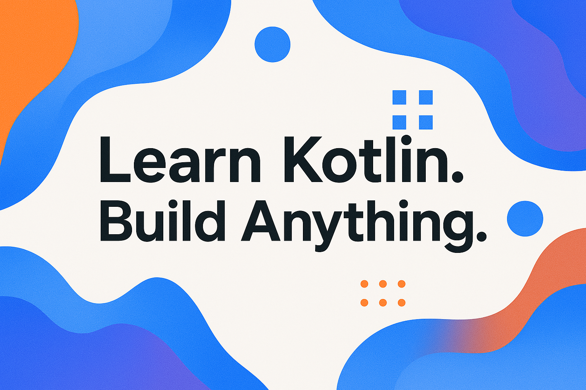
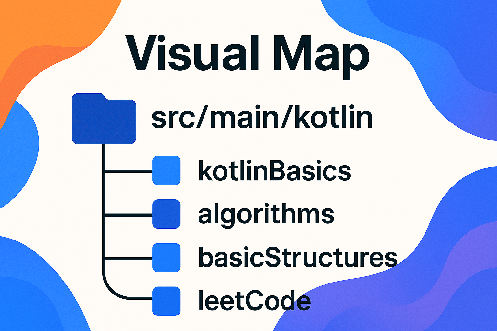
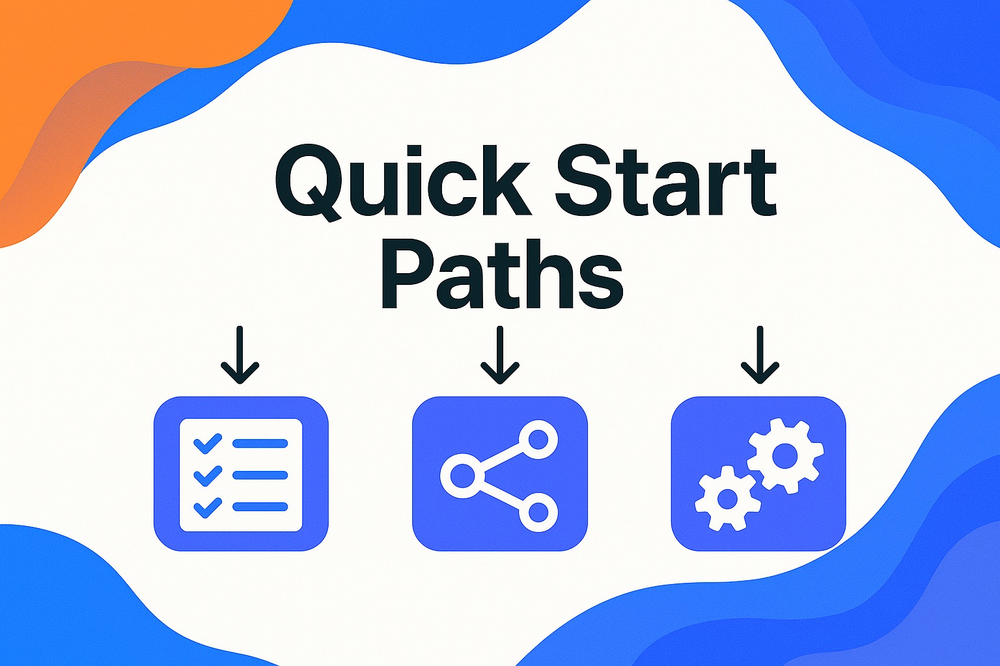
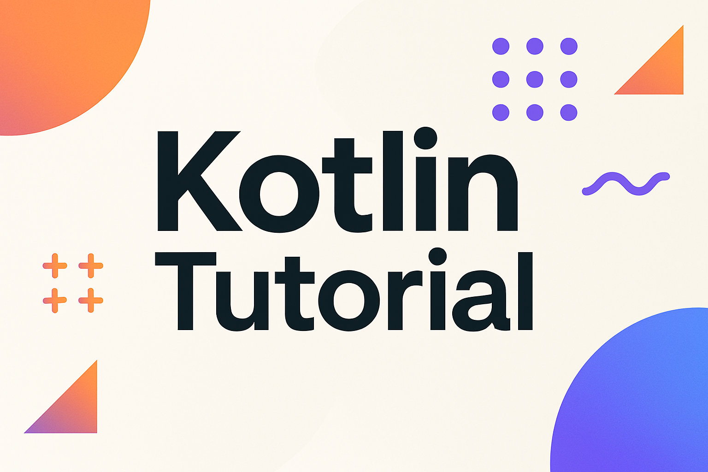

  <picture>
    <source media="(prefers-color-scheme: dark)" srcset="images/ClearLogoInv.png">
    
  </picture>

# Kotlin Educational 🚀

Welcome to **Kotlin Educational** – a growing, hands-on Kotlin learning repository focused on programming fundamentals, data structures, and algorithmic thinking.

<h2>🌐 Visit the Official Kotlin Educational Website</h2>

🔗 <a href="https://kotlinedu.vercel.app/" target="_blank"><strong>kotlinedu.vercel.app/</strong></a>

> ⚠️ **Disclaimer:** This project is actively evolving. While many useful materials are already available, it’s still under construction. Feedback, questions, and contributions are always welcome!

  <picture>
    <source media="(prefers-color-scheme: dark)" srcset="images/SloganSecondPic.png">
    
  </picture>

---

## 📑 Table of Contents

<!-- TOC -->
* [Kotlin Educational 🚀](#kotlin-educational-)
  * [📑 Table of Contents](#-table-of-contents)
  * [📚 What You'll Find Here](#-what-youll-find-here)
  * [🗺️ Project Navigation Map](#-project-navigation-map)
    * [🔍 Folder Overview](#-folder-overview)
  * [🧭 Quick Start Paths](#-quick-start-paths)
      * [👶 For Beginners:](#-for-beginners)
      * [🧠 For Advanced Learners:](#-for-advanced-learners)
      * [💡 For Contributors:](#-for-contributors)
  * [📘 Kotlin Language Guide (in progress)](#-kotlin-language-guide--in-progress-)
    * [📖 Modules:](#-modules)
  * [🏗️ Roadmap](#-roadmap)
  * [🤝 Contributions](#-contributions)
  * [📬 Contact](#-contact)
<!-- TOC -->

## 📚 What You'll Find Here

- 🧠 **[Kotlin Language Guide](https://github.com/khnychenkoav/KotlinEducational/tree/master/src/main/kotlin/kotlinBasics)** – A modular, in-depth Kotlin tutorial: syntax, types, functions, coroutines, and more.
- 🔧 **[Algorithmic Foundations](https://github.com/khnychenkoav/KotlinEducational/tree/master/src/main/kotlin/algorithms)**  
    Classic algorithms implemented and explained in Kotlin: searching, sorting, greedy, dynamic programming, recursion, backtracking, graphs, and more.
- 📦 **[Core Data Structures](https://github.com/khnychenkoav/KotlinEducational/tree/master/src/main/kotlin/basicStructures)** – Idiomatic Kotlin implementations of stacks, queues, trees, graphs, and more.
- 🧩 **[LeetCode Challenges](https://github.com/khnychenkoav/KotlinEducational/tree/master/src/main/kotlin/leetCode)** – Clean Kotlin solutions with helpful commentary and explanations.
- 🛠️ **Gradle Kotlin Project** – Well-structured and ready-to-run with proper packages and module separation.

  <picture>
    <source media="(prefers-color-scheme: dark)" srcset="images/Content.png">
    
  </picture>

## 🗺️ Project Navigation Map
Kotlin Educational is organized as a modular Kotlin Gradle project, with a focus on **clarity**, **learning structure**, and **scalability**.  
Here's a guide to help you navigate through the repository easily:

### 🔍 Folder Overview

  <picture>
    <source media="(prefers-color-scheme: dark)" srcset="images/VisualMap.png">
    
  </picture>

| Folder                                                                                                                            | Purpose                                                      | Target Audience |
|-----------------------------------------------------------------------------------------------------------------------------------|--------------------------------------------------------------|------------------|
| [`src/main/kotlin/kotlinBasics`](https://github.com/khnychenkoav/KotlinEducational/tree/master/src/main/kotlin/kotlinBasics)      | 📘 Kotlin Language Guide – theory, syntax, examples, exercises | Beginners, self-learners |
| [`src/main/kotlin/algorithms`](https://github.com/khnychenkoav/KotlinEducational/tree/master/src/main/kotlin/algorithms)          | 🧠 Classical algorithms implemented in Kotlin                | Intermediate / advanced |
| [`src/main/kotlin/basicStructures`](https://github.com/khnychenkoav/KotlinEducational/tree/master/src/main/kotlin/basicStructures) | 📦 Data structures (stack, queue, trees, etc.)               | All levels |
| [`src/main/kotlin/leetCode`](https://github.com/khnychenkoav/KotlinEducational/tree/master/src/main/kotlin/leetCode)              | 🧩 LeetCode problems with clean solutions                    | Problem solvers |
| [`images`](https://github.com/khnychenkoav/KotlinEducational/tree/master/images)                                                  | 🖼 Assets used in documentation                              | Internal |
| [`others`](https://github.com/khnychenkoav/KotlinEducational/tree/master)                                                   | Some other files for the project (not needed for using repo) | Internal |

---

## 🧭 Quick Start Paths

  <picture>
    <source media="(prefers-color-scheme: dark)" srcset="images/QuickStart.png">
    
  </picture>

#### 👶 For Beginners:
- Start with the [Kotlin Language Guide](https://github.com/khnychenkoav/KotlinEducational/tree/master/src/main/kotlin/kotlinBasics)
- Try modifying and running Kotlin examples
- Read each module like a book, complete exercises

#### 🧠 For Advanced Learners:
- Explore [algorithms](https://github.com/khnychenkoav/KotlinEducational/tree/master/src/main/kotlin/algorithms) and [data structures](https://github.com/khnychenkoav/KotlinEducational/tree/master/src/main/kotlin/basicStructures)
- Benchmark and expand implementations
- Tackle [LeetCode challenges](https://github.com/khnychenkoav/KotlinEducational/tree/master/src/main/kotlin/leetCode)

#### 💡 For Contributors:
- Improve guide modules
- Add test coverage
- Build new utilities in [`scripts`](https://github.com/khnychenkoav/KotlinEducational/tree/master/scripts)

---

## 📘 [Kotlin Language Guide (in progress)](https://github.com/khnychenkoav/KotlinEducational/tree/master/src/main/kotlin/kotlinBasics)

We’re building a full-scale **beginner-friendly Kotlin tutorial**, structured like a book — with theory, examples, and exercises.

> Go beyond algorithms — master Kotlin as a real-world language.

  <picture>
    <source media="(prefers-color-scheme: dark)" srcset="images/Textbook.png">
    
  </picture>

### 📖 Modules:

| Module                             | Status  |
|------------------------------------|---------|
| [Syntax & Structure ](https://github.com/khnychenkoav/KotlinEducational/tree/master/src/main/kotlin/kotlinBasics/core/syntax)            | ✅ Started |
| Variables and Types                | 🔜 Planned |
| Functions                          | 🔜 Planned |
| Control Flow (`if`, `when`, loops) | 🔜 Planned |
| Null Safety                        | 🔜 Planned |
| Object-Oriented Kotlin             | 🔜 Planned |
| Collections & Lambdas              | 🔜 Planned |
| Coroutines & Concurrency           | 🔜 Planned |
| Kotlin Multiplatform               | 🔜 Planned |
| Kotlin Ecosystem & Tooling         | 🔜 Planned |

Each module includes:
- 📘 Markdown-based theory with clear examples
- 💡 Runnable Kotlin examples with comments
- ✍️ Practice tasks and mini-projects
- 📎 Reference links to official docs

📍 *Location:* `src/main/kotlin/kotlinBasics/core/`

---

## 🏗️ Roadmap

Coming soon:
- 🧠 Type system, functions, nullability
- ✍️ Unit tests and automated feedback for exercises
- 📈 Performance analysis and Big-O discussions
- 💻 Real-world mini-projects

---

## 🤝 Contributions

We love collaboration! You can:
- Suggest improvements to the guide
- Add examples or exercises
- Solve or improve existing LeetCode problems
- Improve documentation or add tests
- Or just ⭐ the repo to show support!

---

## 📬 Contact

For feedback, contributions or questions –  
📧 [khnartem@gmail.com](mailto:khnartem@gmail.com)

---

> Happy learning and clean coding!  
> — From Kotlin, with 💛

  <picture>
    <source media="(prefers-color-scheme: dark)" srcset="images/EndingLow.png">
    
  </picture>

