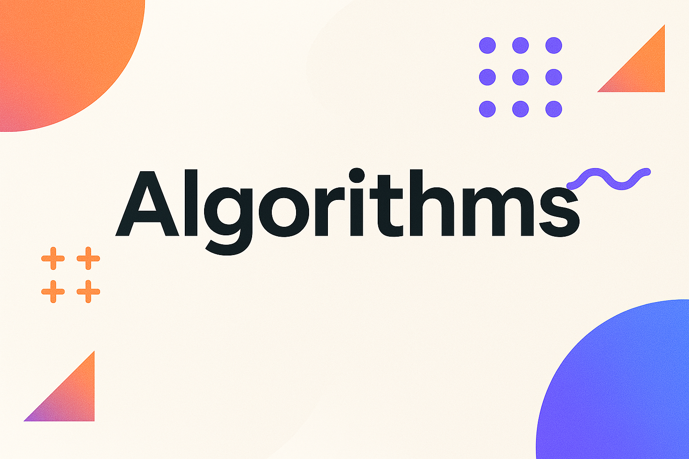
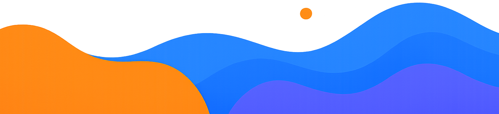

  <picture>
    <source media="(prefers-color-scheme: dark)" srcset="../../../../images/Algorithms.png">
    
  </picture>

# 🧠 Core Algorithms in Kotlin

This section includes implementations of foundational and advanced algorithms in Kotlin. It's designed to serve as a practical reference and a learning tool for algorithmic problem solving.

---

## 1. Basic Algorithms

- ✅ **1.1 Linear Search** – brute-force traversal to find a target element
- ✅ **1.2 Binary Search** – efficient search in a sorted array
- ✅ **1.3 Frequency Count** – hash-based element frequency counting
- ✅ **1.4 Array / String Reversal**
- ✅ **1.5 Palindrome Check** – determine if a string reads the same forward and backward
- ✅ **1.6 Min/Max Finder** – find the smallest and largest values
- ✅ **1.7 Fibonacci Numbers** – iterative & recursive versions
- ✅ **1.8 Prime Number Check**
- ✅ **1.9 GCD & LCM (Euclidean Algorithm)**
- ✅ **1.10 Basic Sorting (Bubble, Insertion, Selection)**
- ✅ **1.11 Is Sorted Check** - basic utility to check if a list is sorted in ascending order.
- ✅ **1.12 Swapper** - basic function to swap to elements in list.

---

## 2. Sorting Algorithms

- ✅ Bubble Sort
- ✅ Insertion Sort
- ✅ Selection Sort
- ✅ Binary Insertion Sort
- ✅ Heap Sort
- ✅ Quick Sort
- ✅ Merge Sort
- ✅ Counting Sort
- ✅ Bucket Sort
- ✅ Radix Sort
- ✅ Shell Sort
- ✅ Timsort
- ✅ Tree Sort
- ✅ Gnome Sort
- ✅ Cocktail Shaker Sort
- ✅ Comb Sort
- ✅ SmoothSort
- ⬜ Block Sort
- ⬜ Flash Sort

---

## 3. String Algorithms

> *Coming soon – not yet implemented.*

- ⬜ Substring Search (Naive, Rabin-Karp)
- ⬜ Knuth–Morris–Pratt (KMP)
- ⬜ Boyer–Moore
- ⬜ Prefix Function
- ⬜ Z-Function
- ⬜ Longest Common Substring (LCS)
- ⬜ Longest Common Subsequence (LCS)
- ⬜ Shortest Common Supersequence
- ⬜ Manacher's Algorithm (palindromes)

---

## 4. Graph Algorithms

> *Coming soon – not yet implemented.*

- ⬜ Depth-First Search (DFS)
- ⬜ Breadth-First Search (BFS)
- ⬜ Shortest Path (Dijkstra)
- ⬜ Bellman–Ford
- ⬜ Floyd–Warshall
- ⬜ A* Algorithm
- ⬜ Topological Sort
- ⬜ Connected Components
- ⬜ Minimum Spanning Trees (Kruskal, Prim)
- ⬜ Tarjan’s Algorithm (bridges & articulation points)
- ⬜ Strongly Connected Components (Kosaraju, Tarjan)
- ⬜ Eulerian Path / Cycle
- ⬜ All Paths (Hyun’s Algorithm)

---

## 5. Dynamic Programming (DP)

> *Coming soon – not yet implemented.*

- ⬜ 0/1 Knapsack
- ⬜ Coin Change
- ⬜ Edit Distance (Levenshtein)
- ⬜ Longest Increasing Subsequence (LIS)
- ⬜ Grid Path Count
- ⬜ Maximum Subarray Sum (Kadane's)
- ⬜ Substring DP (Palindrome, Matrix Chain Multiplication)
- ⬜ Bitmask DP
- ⬜ Memoized Recursion
- ⬜ DP Optimizations (CHT, Monotonic Queue, etc.)

---

## 6. Search Techniques

> *Coming soon – not yet implemented.*

- ⬜ Binary Search on Answer
- ⬜ Ternary Search
- ⬜ Two Pointers
- ⬜ Sweep Line
- ⬜ Mo’s Algorithm

---

## 7. Computational Geometry

> *Coming soon – not yet implemented.*

- ⬜ Segment Intersection
- ⬜ Convex Hull (Graham Scan, Andrew’s)
- ⬜ Rotating Calipers
- ⬜ Point-in-Polygon
- ⬜ Distance from Point to Segment / Line
- ⬜ Polygon Area (Shoelace Formula)

---

## 8. Combinatorics & Number Theory

> *Coming soon – not yet implemented.*

- ⬜ Factorials & Binomial Coefficients
- ⬜ Fast Exponentiation
- ⬜ Sieve of Eratosthenes
- ⬜ Extended Euclidean Algorithm
- ⬜ Modulo C(n, k)
- ⬜ Modular Inverse
- ⬜ Chinese Remainder Theorem (CRT)
- ⬜ Berlekamp–Massey
- ⬜ Subset / Permutation / Combination Generation
- ⬜ Integer / Set Partitioning

---

## 9. Tree Algorithms

> *Coming soon – not yet implemented.*

- ⬜ Tree Traversals (Pre, In, Post-order)
- ⬜ LCA (Binary Lifting / RMQ)
- ⬜ Heavy-Light Decomposition
- ⬜ Centroid Decomposition
- ⬜ Segment Trees (with Lazy Propagation)
- ⬜ Fenwick Trees (BIT)
- ⬜ Tree Decomposition (Sqrt, etc.)

---

## 10. Advanced Techniques

> *Coming soon – not yet implemented.*

- ⬜ Sliding Window
- ⬜ Monotonic Stack / Queue
- ⬜ Cartesian Tree (Treap)
- ⬜ Karatsuba / FFT
- ⬜ Union by Rank + Path Compression
- ⬜ Binary Lifting
- ⬜ Persistent Structures
- ⬜ Offline / Online Divide & Conquer
- ⬜ Max Flow (Ford-Fulkerson, Dinic)
- ⬜ Strassen Matrix Multiplication
- ⬜ Minimax & Alpha-Beta Pruning (Games)

---

## ✅ Legend

- ✅ Implemented
- ⬜ Planned / To-do

  <picture>
    <source media="(prefers-color-scheme: dark)" srcset="../../../../images/EndingLow.png">
    
  </picture>

