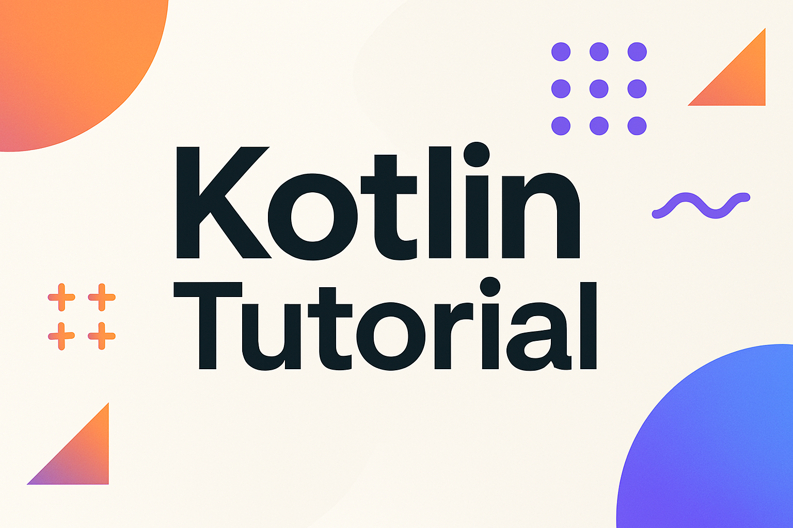

  <picture>
    <source media="(prefers-color-scheme: dark)" srcset="../../../../images/Textbook.png">
    
  </picture>

# 📚 Kotlin Language Learning Module

This section is dedicated to learning **Kotlin as a modern, industrial language** — going beyond algorithms and diving into its syntax, features, architecture, ecosystem, and real-world development.

The goal is to **build a Kotlin knowledge base**: idiomatic, modular, and focused on working examples.

---

## 📦 Modules Overview

### 1. Core Language Fundamentals
- ⬜ Syntax and basic structure
- ⬜ Type system: primitive, nullable, custom types
- ⬜ Functions: declarations, lambdas, inline
- ⬜ Control flow: `if`, `when`, loops
- ⬜ Null safety and smart casting

### 2. Object-Oriented Programming
- ⬜ Classes and objects
- ⬜ Inheritance and polymorphism
- ⬜ Interfaces and multiple inheritance
- ⬜ Visibility modifiers
- ⬜ Data classes, Sealed, Enum classes

### 3. Collections and Functional Operations
- ⬜ Lists, Sets, Maps – mutable and immutable
- ⬜ Filtering, mapping, reducing
- ⬜ Sequences and lazy evaluation
- ⬜ Destructuring and spread operator

### 4. Coroutines and Concurrency
- ⬜ Coroutine basics and lifecycle
- ⬜ Coroutine builders (`launch`, `async`, etc.)
- ⬜ Dispatchers and scopes
- ⬜ Channels and producers/consumers
- ⬜ Cold and hot flows

### 5. Advanced Kotlin Features
- ⬜ Extension functions and properties
- ⬜ Inline functions and reified types
- ⬜ Delegation: `by`, delegated properties
- ⬜ Operator overloading
- ⬜ Kotlin Reflection

### 6. Kotlin Multiplatform (KMP)
- ⬜ Project setup and structure
- ⬜ Sharing code across platforms
- ⬜ expect / actual mechanism
- ⬜ Multiplatform dependencies
- ⬜ Native interop

### 7. Kotlin Ecosystem
- ⬜ Kotlin Standard Library
- ⬜ kotlinx libraries: `coroutines`, `serialization`, etc.
- ⬜ Intro to Ktor
- ⬜ Jetpack Compose (future)
- ⬜ Testing: `kotest`, `mockk`, `assertk`

### 8. Architecture & Patterns
- ⬜ DSL creation in Kotlin
- ⬜ Clean Architecture principles
- ⬜ MVVM with coroutines and Flow
- ⬜ Dependency Injection (Koin / Dagger / Hilt)

---

## 🛠 Format

- 📄 Each topic is split into files with **explanatory comments** and **working examples**
- 📘 Every module will be backed by Markdown summaries and theoretical notes
- ✅ Once implemented, modules will be marked accordingly

---

## ✅ Legend

- ✅ Implemented
- ⬜ Planned

---

## 🚧 Current Progress

We are currently laying the foundation of the Kotlin learning track.
Coming soon: syntax, types, functions.

  <picture>
    <source media="(prefers-color-scheme: dark)" srcset="../../../../images/EndingLow.png">
    
  </picture>

