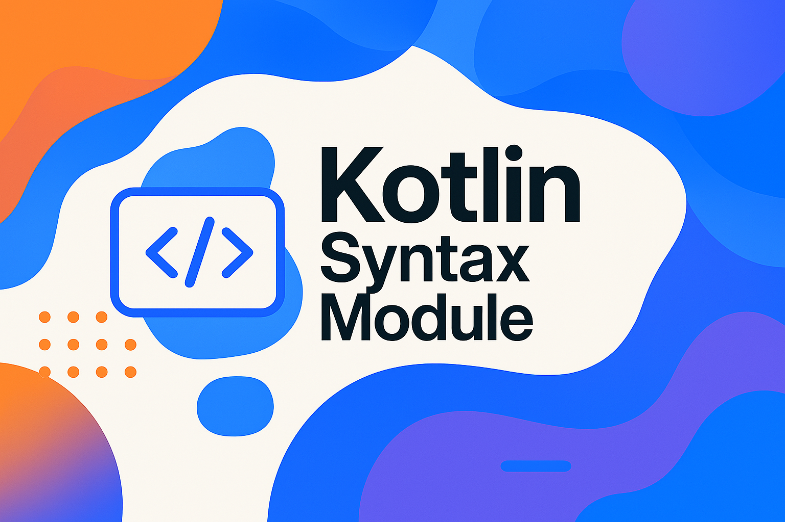

  <picture>
    <source media="(prefers-color-scheme: dark)" srcset="../../../../../../images/SyntaxModule.png">
    
  </picture>

# 🧠 Kotlin Syntax Module

Welcome to the first chapter of your Kotlin journey. This section introduces the **core syntax of the language**, laying the foundation for everything else — from data types and functions to classes, coroutines, and architecture.

You’ll learn not just how to write Kotlin, but how to think in Kotlin: clearly, safely, and idiomatically.

---

## 📘 What You Will Learn

- How Kotlin differs from other languages like Java and Python
- The structure of a Kotlin program: files, functions, entry points
- How to write clean, idiomatic code without unnecessary boilerplate
- What’s under the hood: compilation, bytecode, and Java interop
- Kotlin's design philosophy and why developers love it

---

## 🗂️ Topics and Content Structure

Each topic is organized into **three types of files**:

- `notes/` — Theory, concepts, and explanations
- `examples/` — Minimal working code examples
- `exercises/` — Tasks for self-practice

| Topic                       | Notes                          | Examples                       | Exercises                       |
|----------------------------|----------------------------------|--------------------------------|---------------------------------|
| Kotlin History & Philosophy| `notes/History.md`              | `examples/history`             | `exercises/history`             |
| Main Function & Structure  | `notes/MainFunction.md`         | `examples/mainFunction`        | `exercises/mainFunction`        |
| Printing Output            | `notes/Println.md`              | `examples/println`             | `exercises/println`             |
| Comments                   | `notes/Comments.md`             | `examples/comments`            | `exercises/comment`             |
| Expressions & Statements   | `notes/Expressions.md`          | `examples/expressions`         | `exercises/expressions`         |
| Semicolons & Formatting    | `notes/Semicolons.md`           | `examples/semicolons`          | `exercises/semicolons`          |
| Idiomatic Code & Style     | `notes/IdiomaticStyle.md`       | `examples/idiomatic`           | `exercises/idiomatic`           |
| Under the Hood             | `notes/UnderTheHood.md`         | *(N/A)*                        | *(N/A)*                         |
| Kotlin vs Other Languages  | `notes/LanguageComparisons.md`  | `examples/languageComparisons` | `exercises/languageComparisons` |

---

## 📚 External Resources

- 🔗 [Official Kotlin Docs](https://kotlinlang.org/docs/home.html)
- 🎮 [Kotlin Playground](https://play.kotlinlang.org/)
- ✍️ [JetBrains Kotlin Blog](https://blog.jetbrains.com/kotlin/)
- 📜 [Kotlin History Announcement](https://blog.jetbrains.com/kotlin/2011/07/hello-world-2/)
- 📏 [Kotlin Style Guide](https://kotlinlang.org/docs/coding-conventions.html)

---

## ✅ Legend

- `notes/` → Detailed theory & background
- `examples/` → Concise runnable examples
- `exercises/` → Try it yourself

---

📌 **Tip**: You can go through this module like a book — one topic at a time — or jump between sections as needed. Everything here is designed to be modular, beginner-friendly, and production-relevant.

  <picture>
    <source media="(prefers-color-scheme: dark)" srcset="../../../../../../images/EndingLow.png">
    
  </picture>

