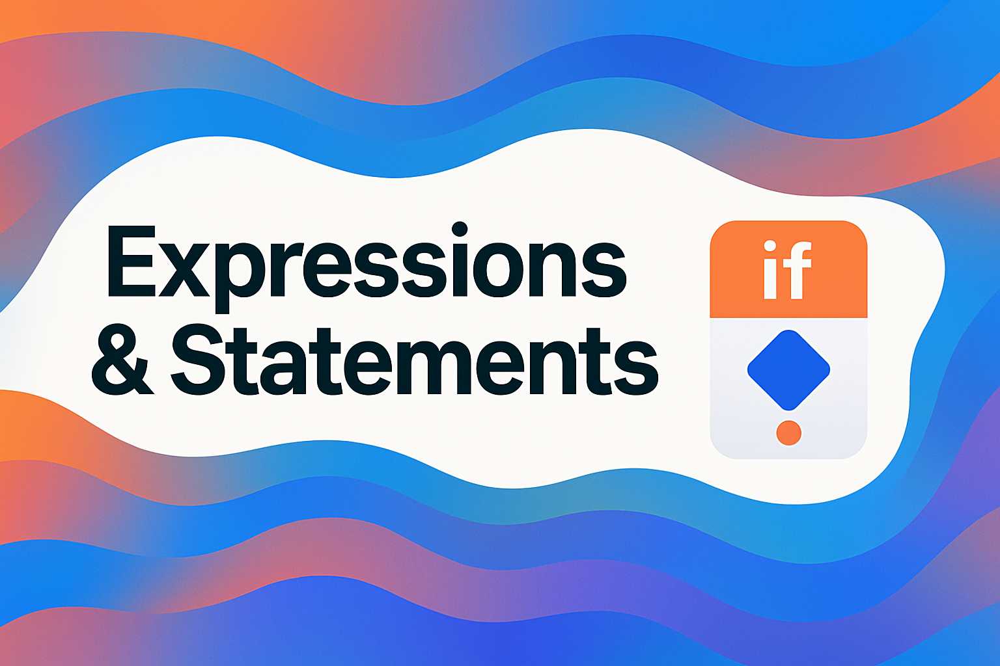

<div align="center">
  <picture>
    <source media="(prefers-color-scheme: dark)" srcset="../../../../../../../images/Expressions.png">
    
  </picture>
</div>

# 🌀 Expressions & Statements in Kotlin

One of Kotlin’s most powerful (and sometimes confusing) features is that **many constructs are expressions**—they produce a value—rather than mere statements. This design allows you to write more concise, functional-style code.

---
## 🧠 What You Will Learn

- The difference between **expressions** and **statements**
- How `if`, `when`, and `try` can act as expressions
- Why Kotlin doesn’t have a ternary operator (`?:`) for conditionals
- How expressions return values vs. how statements operate
- Best practices and pitfalls regarding expressions in Kotlin

---
## 1. Expressions vs. Statements

In many languages (like Java, C++), **statements** do not return a value, while **expressions** do. In Kotlin:

- A **statement** is an instruction that doesn’t produce a value.
- An **expression** is code that **evaluates** to a value.

### Quick examples:

```kotlin
val x = 5 // This is a statement: we assign 5 to x

val y = if (x > 0) 10 else 20
// The `if (x > 0) 10 else 20` part is an expression 
// that evaluates to either 10 or 20.
```

In Kotlin, many traditional “statements” (like `if`) are **expressions** if you use them that way. However, some constructs (like `for` loops) remain statements and **do not** produce a value.

---
### 2. `if` as an Expression

You may be used to `if` being just a statement. But in Kotlin:

```kotlin
val max = if (a > b) a else b
```

- `if (a > b) a else b` evaluates to either `a` or `b`.
- You can place multi-line blocks inside `if`/`else`, but remember the **last expression** in each block is what’s returned:

```kotlin
val message = if (isLoggedIn) {
    logEvent("User is logged in")
    "Welcome back!"
} else {
    logEvent("Anonymous user")
    "Please sign in."
}
```

The block returns its last expression (`"Welcome back!"` or `"Please sign in."`).

#### 🔎 No Ternary Operator?

Kotlin deliberately **omits** the `?:` ternary operator found in languages like Java or C, because `if` itself is flexible enough to serve the same purpose—while staying more readable.

---
### 3. `when` as an Expression

Similar to `switch` statements in other languages, but on steroids: `when` can be used as an **expression** that returns a value:

```kotlin
val result = when (val input = readLine()) {
    null -> "No input given"
    "admin" -> "Welcome, Admin!"
    else -> "Hello, $input!"
}
```

- We can have `when` return different types if needed (though usually they unify to a single type).
- The last line of each `when` branch is the value for that branch.
- If no usual branch matches, `else` branch throws some specific value or an exception.
> In Kotlin 'when' is a logically complete statement, meaning it must have an else branch.


---
### 4. `try` as an Expression

Kotlin also treats `try` as an **expression**:

```kotlin
val number = try {
    someString.toInt()
} catch (e: NumberFormatException) {
    -1
}
```

Here, if `.toInt()` fails, the expression **evaluates** to `-1`. Then the `number` variable is set to `-1`. If the `try` block succeeds, `number` is set to the result of `someString.toInt()`.

> If there’s a `finally` block, it does not affect the return value — the expression result is either from the `try` part or the `catch` part.

---
### 5. What **isn’t** an Expression in Kotlin?

Despite Kotlin’s emphasis on expressions, some constructs remain statements (they don’t produce a value):

1. **`while`**, **`do-while`**, **`for`** loops  
   They just execute code repeatedly. They do not evaluate to a value that you can store in a variable.

2. **Variable Declarations**:  
   `val x = 10` is considered a statement (the assignment operation itself does not return a value in Kotlin). So you can’t do:
   ```kotlin
   val y = (val x = 3) // ❌ Not valid
   ```

3. **`return`, `break`, `continue`**  
   They alter control flow rather than produce a meaningful value in the normal sense of the function body.
    - `throw` is special: it is technically an expression of type `Nothing`, which can be used in certain advanced scenarios.
    - But typically you won’t rely on `throw` as a “value” outside special contexts.

---
### 6. Single-Expression Functions

> Don't worry, you'll learn more about the features and how they work soon, but for now just remember the facts below
Kotlin allows **single-expression** function bodies, which return the value of that expression directly:

```kotlin
fun max(a: Int, b: Int): Int = if (a > b) a else b
```

- No braces needed.
- The return type can often be inferred.

But it’s more of a **syntax sugar** for short functions. For larger functions, prefer standard braces for clarity.

---
### 7. Why Expressions Matter

- **Concise code**: no need for a separate variable or `return` statement in many places.
- **Functional style**: chain logic in a more expression-oriented way, pass them into lambdas.
- **Fewer mistakes**: less repetitive syntax (e.g., no ternary operator needed).

#### Example

```kotlin
fun compare(a: Int, b: Int): String {
    return when {
        a == b -> "They are equal"
        a > b -> "a is bigger"
        else -> "b is bigger"
    }
}
```

`when` is an expression returning a `String`. Much simpler than a `switch` in older languages plus separate `return`.

---
### 8. Under the Hood

- The Kotlin compiler transforms your `if`/`when`/`try` expressions into standard branching logic in JVM bytecode.
- It uses a combination of local variables and jump instructions, but you never see that at the Kotlin level.
- The final value is typically stored in a synthetic temp variable before being assigned to your target variable.

In short, nothing magical—just convenient!

---
### 9. Common Pitfalls

| Pitfall                                 | Why it happens                 | How to avoid                        |
|-----------------------------------------|--------------------------------|-------------------------------------|
| Mixing expression and statement styles  | Trying to treat loops like expressions | Keep in mind: loops remain statements |
| Writing unreadable if/when inline       | Over-nesting in a single line  | If it’s too complex, break it into steps |
| Expecting `assignment` to be an expression | `x = 3` does not produce a value in Kotlin | Use an explicit approach, e.g. `val x = 3` in a separate statement |

---
### 10. Wrap-Up and Next Steps

- **Expressions** return values, **statements** do not.
- In Kotlin, `if`, `when`, and `try` can yield results.
- Loops (`for`, `while`) and declarations are statements and do not produce values.
- This approach makes code concise, especially for short logic or single-expression functions.

**Next**: Check out the examples in `examples/expressions`, then try the exercises in `exercises/expressions`.  
Remember: “Idiomatic Kotlin” loves expressions, but keep them readable!

---
## 📚 Further Reading

- [Kotlin Official Docs: Control Flow](https://kotlinlang.org/docs/control-flow.html)
- [Kotlin Slack Community](https://kotlinlang.org/community/) – for questions about expression-based style

<div align="center">
  <picture>
    <source media="(prefers-color-scheme: dark)" srcset="../../../../../../../images/EndingLow.png">
    
  </picture>
</div>
