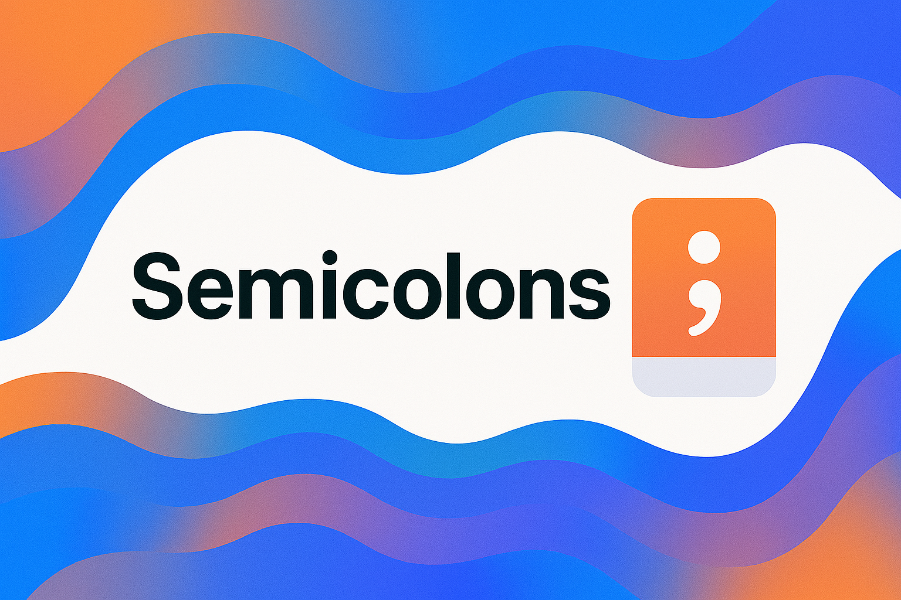

<div align="center">
  <picture>
    <source media="(prefers-color-scheme: dark)" srcset="../../../../../../../images/Semicolons.png">
    
  </picture>
</div>

# ❌ Do We Need Semicolons in Kotlin?

One of the first things you'll notice in Kotlin is this:

```kotlin
println("Hello")
println("World")
```

...and not a single `;` in sight.

---

## 🧠 Kotlin’s Philosophy

Kotlin was designed to **minimize unnecessary syntax**.  
Semicolons (`;`) fall into that category — they are **optional**, **not required**, and **discouraged** in idiomatic code.

> ✅ Semicolons **can** be used — but you almost never need them.

---

## ✅ When Can Semicolons Be Used?

Kotlin **allows** semicolons to separate multiple statements **on the same line**:

```kotlin
val a = 1; val b = 2
println(a + b)
```

But this is **not recommended** unless you're doing quick one-liners or REPL demos.

You can also technically end any line with `;`, but there's **no benefit**:

```kotlin
val name = "Kotlin";
println("Hello, $name!");
```

⛔ **Don't do this.** Kotlin is perfectly happy without them.

---

## 🔍 How Does Kotlin Know Where a Statement Ends?

Kotlin uses **automatic semicolon inference**, just like Python or Swift.

- A line that ends naturally (with a closing parenthesis, bracket, or expression) is enough.
- Newlines and indentation help the compiler know where a statement ends.

Kotlin **won’t split an expression** across lines unless it's syntactically valid:

```kotlin
val total =
    5 + 6 + 7
```

✅ This works just fine!

But this **won’t**:

```kotlin
val total = 5 +
println(total) // ❌ Unexpected tokens
```

---

## ❌ Common Mistakes for Java Developers

Coming from Java or C-style languages?

Here’s what **not to do**:

```kotlin
if (x > 0);
    println("Positive") // ← ❗ Oops, this runs unconditionally
```

That `;` after the `if` ends the statement early — and the block below is always executed.

> 🧠 Kotlin behaves exactly like Java in this case — the semicolon terminates the `if`.

---

## 📐 Linting and Code Style

Idiomatic Kotlin discourages semicolon use.  
All major formatters (IntelliJ, `ktlint`, `detekt`) will:

- 🔧 remove unnecessary `;`
- ⚠️ flag style violations if you're too "C-style"

---

## 📌 Summary

| Rule                            | Use?      |
|---------------------------------|-----------|
| End every line with `;`         | ❌        |
| Multiple statements per line    | ⚠️ allowed, but discouraged |
| Inside `for`, `if`, `while`     | ❌ don’t end conditions with `;` |
| In REPL / scratch files         | ✅ optional, for quick chaining |

---

## 💬 Reflect and Try

- Remove semicolons from Java-like Kotlin — does it still work?
- Can you write an `if`, `when`, and loop with **clean formatting** and no `;`?
- Try inserting a `;` after a control statement — does it still behave correctly?

---

## 🎓 What's Next?

- Now that your Kotlin is cleaner — let’s explore some examples and exercises in the exact folder!
- Up next: `notes/IdiomaticStyle.md`

Keep your code ✨ elegant, expressive, and semicolon-free!

<div align="center">
  <picture>
    <source media="(prefers-color-scheme: dark)" srcset="../../../../../../../images/EndingLow.png">
    
  </picture>
</div>