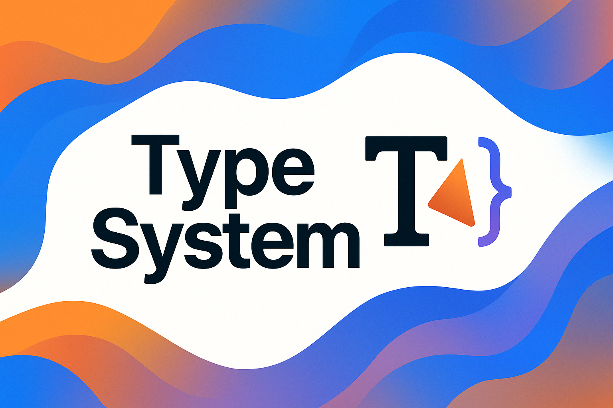
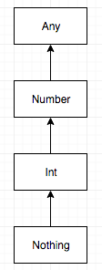

<div align="center">
  <picture>
    <source media="(prefers-color-scheme: dark)" srcset="../../../../../../../images/Types.png">
    
  </picture>
</div>

# Kotlin Data Types

## Basic Data Types in Kotlin

Kotlin provides a range of **built-in data types** covering numbers, booleans, characters, and strings. Each type has a specific purpose and behavior, often aligning with Java’s primitive types under the hood for efficiency. In Kotlin, *everything is an object* in terms of the language model, but the compiler optimizes many types (Int, Char, etc.) to JVM primitives for performance. This means that values like integers and booleans are usually stored directly on the **stack** (as primitive values) when possible, while larger objects are allocated on the **heap**. Below we outline Kotlin’s primary data types and their characteristics:

- **Numeric Types:** Kotlin has six numeric types: four integer types and two floating-point types. The integer types are Byte (8-bit), Short (16-bit), Int (32-bit), and Long (64-bit), each with its defined range of values. For example, an Int ranges from –2,147,483,648 to 2,147,483,647. The floating-point types are Float (32-bit single precision) and Double (64-bit double precision) following the IEEE 754 standard. By default, integer literals are inferred as Int and fractional number literals as Double unless you specify otherwise (e.g. using an L suffix for Long or f for Float). Under the hood, these numeric types correspond to Java primitives when non-null (e.g. a Kotlin Int is a JVM int). This means arithmetic on Kotlin numbers is efficient and uses the CPU’s primitive operations. If a numeric variable is **nullable** (e.g. Int?), or if it’s used in a generic context, it will be **boxed** (wrapped in an object like java.lang.Integer) on the heap. Kotlin also provides unsigned versions (UByte, UInt, etc.) for specialized use cases, though these are used less frequently.

- **Boolean:** Kotlin’s Boolean type represents a logical true/false value. It can be either true or false (with a nullable form Boolean? if needed). Booleans compile down to the JVM primitive boolean (typically 8 bits). Like numeric types, a non-null Boolean is stored as a primitive (on the stack or within an object’s memory), and a Boolean? would be a boxed Boolean object if it holds a value. Booleans are commonly used in conditional expressions (if, when) and logical operations. Kotlin does **not** implicitly convert other types to Boolean – for example, 0 or "" are not automatically false as they might be in Python or JavaScript. Only actual Boolean values are allowed in conditional checks, making the code type-safe and clear.

- **Char (Character):** The Char type represents a single character, such as 'A' or '🤖'. Character literals are enclosed in single quotes. On the JVM, a Kotlin Char is stored as a primitive char (16-bit Unicode code unit). This means it can represent Unicode characters in the Basic Multilingual Plane (0 to 65,535); characters outside that (like certain emoji or historical scripts) are represented by a pair of Char values (surrogate pair) because one Char alone is 16 bit. Kotlin Char is not directly a number; you cannot directly do arithmetic on Char types without conversion. For example, in Java you might do char + int, but in Kotlin you must convert a Char to an Int (using .code or toInt()) before arithmetic. This design prevents accidental treatment of characters as numbers. If you need the numeric ASCII/Unicode code of a character, you can convert it (Kotlin provides functions like digitToInt() for chars that are digits, etc. Like other primitives, a non-null Char is optimized as a JVM char, and a nullable Char? would be boxed as a Character object if use.

- **String:** The String type in Kotlin represents text. Strings are sequences of characters and are enclosed in double quotes (e.g. "Hello, Kotlin"). Under the hood, Kotlin’s strings are implemented as Java String objects, which use UTF-16 encoding for character. Each character in a string uses 2 bytes in memory (because of UTF-16). **Strings are immutable** – once created, you cannot change a string’s content. Any operation that transforms a string (such as replacing or appending content) will produce a new String instance rather than modifying the original. This behavior is inherited from Java and ensures that strings can be safely shared without risk of mutation. You can access characters of a string by index (e.g. myString[0]) and iterate over a string’s characters. Kotlin provides rich support for string literals, including *escaped strings* with special characters (like "\n" for newline) and *raw strings* delimited by """ for multi-line text or strings needing no escaping. For example:

```kotlin
val greeting = "Hello, Kotlin\n"    // Escaped string with newline
val multiLine = """
    |Kotlin strings can span
    |multiple lines with ease.
    """.trimMargin()
```

In the above, greeting ends with a newline character, and multiLine demonstrates a triple-quoted string with trimMargin() to remove the leading | margin prefix. Because strings are objects on the heap (even a literal like "abc" is a String object), they are referenced from the stack or other objects. Despite being objects, strings in Kotlin (and Java) can be treated like values – comparisons with == check for content equality, and the immutability means you don’t worry about shared modifications.

> **Under the Hood – Primitives vs Objects:** One important aspect of Kotlin’s design is that it **unifies** the type system. You use Int, Char, Boolean, etc. as if they are regular classes (and they do have methods and properties), but the compiler uses JVM primitives for performance whenever possible. For example, an Int in Kotlin has methods like toLong() or properties like MAX_VALUE, but if you just use it in a calculation or store it in a non-null variable, it’s using a 32-bit machine integer behind the scenes. This means operations are fast and memory efficient. However, if you use these types in a context that requires an object (like a generic collection or a nullable reference), Kotlin will automatically **autobox** the value into its object wrapper (e.g. converting an int to an Integer). Autoboxing and its reverse (unboxing) are automatic, but they have a slight overhead: boxed values are stored on the heap, and comparing two boxed numbers uses object identity unless you explicitly compare their unboxed values. Kotlin follows Java’s behavior of caching small boxed numbers: for example, two Int? instances representing the value 100 may actually refer to the same cached object in that range, so 100 as Int? === 100 as Int? can be true for small values. But outside the cache range, each boxing produces a new object, so 10000 as Int? boxed twice will not be === (same reference) even though == (value equality) will be true. The key takeaway is that Kotlin gives you the convenience of high-level types with the performance of primitives, but you should be aware of boxing in performance-sensitive code or when checking reference equality.

---

## Operations and Functions on Data Types

Each data type in Kotlin comes with a set of built-in operations and functions, making common tasks straightforward. Here we highlight the key operations for numbers, booleans, and strings (which cover most use cases), and mention how they compare to other languages when relevant:

- **Arithmetic on Numbers:** Kotlin supports the standard arithmetic operators for numeric types: addition `+`, subtraction `-`, multiplication `*`, division `/`, and remainder `%`. These work as you’d expect from languages like C/Java/Python. If you use them on integer types (`Byte`, `Short`, `Int`, `Long`), the operations are performed with 32-bit or 64-bit integer arithmetic (with wrap-around on overflow, as we’ll discuss in edge cases). Integer division truncates toward zero by default – any fractional part is discarded. For example, `5 / 2` with integers yields `2` (not `2.5`). If you want a floating-point result, at least one operand must be a float or double (e.g. `5 / 2.0` or `5.toDouble() / 2`). Kotlin does **not** perform implicit widening conversions for numbers in assignments or function calls – you can’t just use an `Int` where a `Long` is expected, for instance. You must call conversion methods like `.toLong()` or `.toInt()` explicitly. This design avoids ambiguity and unintentional data loss. However, in arithmetic expressions, Kotlin is smart about mixing types: if you write `val x = 1L + 3` (Long plus Int), the `3` is converted to `Long` automatically *for that operation* and the result is a `Long`. In other words, the operators are overloaded for combinations of numeric types, so you don’t usually need a cast *within* an expression – the compiler will choose a common type that prevents loss of information. (This is why `1L + 3` works and results in a `Long`, but assigning an `Int` to a `Long` variable without `toLong()` doesn’t compile – assignment is not an expression to be resolved in the same way).

  Kotlin also supports **augmented assignment** (compound operators) like `+=`, `-=`, etc., and these follow the same rules. For example, `var count = 5; count += 3` will work (resulting in `8`) and type-check, but if `count` were a `Byte`, `count += 1` is allowed only because it’s equivalent to `count = (count + 1).toByte()` (the compiler does the conversion back to `Byte`).

- **Comparison and Equality:** For all numeric types, you can compare with `<`, `<=`, `>`, `>=` and these work as usual. Kotlin’s `==` operator checks *structural equality* (i.e., whether the values are equal, not necessarily the same object). For primitives like numbers, this just compares the numeric value. One subtlety is when comparing floating-point numbers: if two operands are statically `Float` or `Double`, the comparison uses IEEE 754 rules, so for instance `Double.NaN == Double.NaN` is false (since IEEE says `NaN` is not equal to anything, even itself). However, if you compare them in a context that isn’t statically a primitive (say, two `Any` references that happen to hold `Double`s), Kotlin will fall back to a more general comparison that *does* consider `NaN`s equal (to ensure total ordering in collections). This is an edge case, but worth knowing: basically `NaN == NaN` is false in plain code, but if you had a list of `Double`s, `listOf(Double.NaN) == listOf(Double.NaN)` would be true because it uses `Double.equals` under the hood. For most situations, you won’t hit this difference, but it’s an example of Kotlin trying to balance IEEE correctness with practicality in collections.

- **Bitwise operations:** Kotlin provides bitwise operators for integers, but they are called as functions (to avoid confusion with the shift operators in other languages). You have `shl(bits)` for left shift, `shr(bits)` for right shift, `ushr(bits)` for unsigned right shift, and `and`, `or`, `xor`, `inv` for bitwise AND/OR/XOR/NOT. These can be used in infix form, so it looks like `value shl 2` or `a xor b`. This is mostly a cosmetic difference from Java/C syntax (`<<`, `>>`, `&`, `|`, `^`, `~`), but function names make it clear and avoid introducing more symbols. Underneath, they compile to the same machine instructions. For example, `val x = 1 shl 3` will yield `8`.

- **Numeric Conversion Functions:** All number types have methods to convert to other number types explicitly. For instance, `toByte()`, `toInt()`, `toLong()`, `toFloat()`, `toDouble()`, etc. are available on every numeric type. These handle overflow by truncation (just like casting in Java). If you convert a large `Long` to `Int` with `toInt()`, it simply drops the high bits that don’t fit, which can result in a negative or totally different number (no exception is thrown). If you need to check for overflow conditions, you must do it in code (Kotlin doesn’t throw an overflow exception by default, aligning with Java’s behavior – more on this in edge cases).

- **Boolean operations:** Booleans in Kotlin support the typical logical operations. You use `&&` for logical AND, `||` for logical OR, and `!` for NOT. These operators work *lazily* (short-circuit evaluation) – meaning if the left side of an `&&` is false, Kotlin won’t even evaluate the right side (because the result is already determined false); similarly, if the left side of `||` is true, it skips evaluating the right side. This is the same behavior as in Java, C, and many other languages, and it’s useful to avoid unnecessary work or null-pointer exceptions in expressions like `obj != null && obj.isValid()`. Kotlin also provides bitwise boolean operations as infix functions `true.and(false)` or `true or false`, but those are rarely used; typically `&&`/`||` suffice for most needs.

  Comparison operations on booleans (like equality) are straightforward: `true == false` yields `false`, etc. There is no implicit conversion between booleans and other types – you can’t treat an `Int` as a boolean or vice versa without explicit conversion (and there’s really no meaningful conversion except numeric `0`/`1` to `false`/`true`, which you’d do manually if needed). This is a deliberate design choice to prevent mistakes. In Python or JavaScript, values like `0`, `""`, or `null` can be treated as falsy in conditionals, but Kotlin requires a real Boolean. For example, in Python you might write `if myList:` to check if a list is non-empty. In Kotlin, you must write `if (myList.isNotEmpty())` because `myList` by itself isn’t a Boolean. This explicitness can catch errors (you won’t accidentally treat the wrong thing as a condition) and makes the code’s intent clear.

- **String operations:** Kotlin strings come with a rich set of operations. Concatenation can be done with the `+` operator: if either operand of `+` is a string, Kotlin will build a new string by concatenation. For example, `"Hello, " + name` will produce a new string by appending the content of `name`. Under the hood, this might use a `StringBuilder` for efficiency, similar to Java’s `+` operator on strings. However, idiomatic Kotlin often favors **string templates** over manual concatenation. A *string template* lets you embed values directly in a string literal by using the `$` symbol. For instance:

```kotlin
val name = "Ada"
println("Hello, $name!")    // Prints: Hello, Ada!
println("2 + 2 = ${2 + 2}") // Prints: 2 + 2 = 4
```

In the first case, `$name` is replaced with the value of the variable `name`. In the second, anything in `${...}` is evaluated as an expression, so `${2 + 2}` became `4`. Kotlin automatically calls `.toString()` on the expression results as needed. String templates make constructing strings easier to read and less error-prone than concatenating multiple pieces. They are similar to f-strings in Python or template literals in ES6 JavaScript.

Strings also support indexing (`str[i]` gives the i-th character) and iteration. You can compare strings with `==` for value equality (which calls `equals` under the hood, so it checks character by character) or with `===` to check if two string references point to the exact same object (which is rarely needed). Because strings are immutable, if `a == b` is true, there’s no real downside if they were different objects or not, aside from memory. In Kotlin, you rarely use `===` on strings (or other values) unless you specifically care about reference identity.

Additionally, Kotlin has a variety of helpful string library functions: e.g. `string.length` (property for length), `string.substring(...)`, `string.startsWith("prefix")`, `string.toUpperCase()`, and many extension functions. You can also iterate over a string like `for (c in string)` to get each character. Since strings are essentially arrays of characters, they also have methods to get slices, split, etc. It’s worth noting that when you iterate a Kotlin string or access by index, you get `Char` values. If those chars are part of a surrogate pair (for a non-BMP Unicode character), you’ll get the individual surrogates one by one. Handling full Unicode code points requires additional logic (similar to Java). This is a low-level concern but important for certain text-processing tasks.

- **Other operations:** Kotlin data types come with many standard library functions. For example, numbers have `coerceIn`/`coerceAtLeast` to clamp values, `absoluteValue`, and so on. Booleans have `xor` as an infix function if you need logical XOR. `Char` has classification functions like `isLetterOrDigit()`, `isUpperCase()`, etc. Many of these are similar to Java’s `Character` methods. Kotlin tends to surface these as methods on the type for a more object-oriented feel (even though under the hood they might be static utility calls).

In general, Kotlin’s operations aim to be **unsurprising** for anyone with experience in languages like Java or C#. If you come from Python or JavaScript, the main differences are static typing (meaning you can’t mix types arbitrarily in an operation without conversion) and the lack of implicit truthiness/falsiness for non-boolean values. But Kotlin’s standard library is quite comprehensive, so most of what you need is readily available as methods or infix operators.

---

## Edge Cases and Subtleties

Now that we’ve covered the basics, it’s important to understand some edge cases and subtle behaviors of Kotlin’s data types. These are the kind of “gotchas” or important details that intermediate and advanced developers care about:

- **Integer Overflow:** Kotlin’s `Int` and `Long` types have fixed size (32-bit and 64-bit respectively), so they will overflow just like in Java when the values go out of range. For instance, `Int.MAX_VALUE + 1` wraps around to `Int.MIN_VALUE` (overflowing to a negative number). Unlike some languages (e.g. Python, which can handle arbitrarily large integers, or languages that throw an overflow exception), Kotlin (on the JVM) does not check for overflow in basic arithmetic – it relies on the CPU’s two’s complement arithmetic. This design is a conscious choice for performance. The Kotlin team noted that automatic overflow checks would slow down arithmetic significantly and would be hard to implement without JVM support. So, you should be mindful: operations on `Int`/`Long` can silently overflow. If you need to detect overflow, you can use larger types (e.g. use `Long` to detect overflow of `Int` range, or use libraries/`BigInteger` for arbitrary precision) or use explicit checks. There are utility functions in Kotlin like `Math.addExact()` (from Java’s standard library) or experimental features for unsigned arithmetic, but by default nothing stops `2_000_000_000 + 2_000_000_000` from rolling over into a negative number. In contrast, **Python’s `int`** will just keep growing in bit-length to accommodate any size (no overflow, but you may get memory or performance hits for huge numbers), and **JavaScript’s `Number`** (being a 64-bit float) will not overflow to negative on large integers but will lose integer precision past 2^53. Kotlin sticks to deterministic 32/64-bit overflow like Java/C, which is something to be aware of. (Kotlin does offer an `UInt` (32-bit unsigned) and `ULong` (64-bit) for cases where you want modulo arithmetic in a different range, but they too will overflow within their range.)

- **Floating-Point Precision and Special Values:** Kotlin’s `Float` and `Double` follow IEEE 754, which means they carry the usual quirks of binary floating-point. A `Double` has about 15–16 decimal digits of precision. Operations on floating points can introduce rounding errors (e.g. `0.1 + 0.2` might not exactly equal `0.3` due to binary representation issues). Kotlin doesn’t change any of that. One thing to note, as mentioned, is the treatment of `NaN` and `-0.0` in equality: normally `NaN != NaN`, but if you have them in a generic context, Kotlin might consider them equal for object equality. Also, `-0.0` is considered distinct from `0.0` in IEEE (though they compare as equal in direct `==`), but in sorting or comparisons in certain contexts, Kotlin might treat `-0.0` as smaller so that a total order can be achieved. These are corner cases; just remember that floating-point math has these edge behaviors. If you need decimal arithmetic (like for currency), you should use `BigDecimal` or other libraries, as Kotlin’s `Float`/`Double` are binary floating point, same as Java’s.

- **String Immutability:** As noted, strings are immutable. Attempting to change a character of a string (e.g. doing something like `myStr[0] = 'H'`) will not compile. All string manipulation operations will return new strings. For example, `val upper = myStr.uppercase()` returns a new string with characters uppercased, leaving `myStr` unchanged. This is usually fine, but keep in mind that creating lots of new strings in a loop, for instance, can have a performance cost due to allocations. In performance-critical code, you might want to use a `StringBuilder` (which is mutable) to accumulate text, then convert to a `String` at the end. Kotlin provides a convenient `buildString { }` function that helps with this (it gives you a `StringBuilder` to append to, and then returns the final `String`). As an immutability benefit, you never have to worry about a function modifying your string behind your back; any “modification” produces a fresh string.

- **Equality and Identity:** Kotlin’s equality operators can trip up those coming from Java. In Kotlin, `==` is *value equality* (equivalent to `.equals()` in Java) and `===` is reference equality. This means if you compare two strings with `==`, it will check their content equality, which is often what you want. In Java, using `==` on `String` would check if they’re the same object (which is usually not intended for content comparison). Kotlin fixes that by redirecting `==` to a safe equals check (it even handles null correctly – `a == b` in Kotlin doesn’t throw if `a` is null, whereas in Java `a.equals(b)` would throw NPE if `a` is null). This is generally positive, but just remember: use `===` if you truly need to know if two references point to the exact same object (which is rare for value types like numbers or strings, but maybe relevant for singleton objects or cases where identity matters). Also, because of autoboxing, two variables of type `Int?` with the same value might not be `===` if they aren’t in the cache range. For example, `val a: Int? = 10000; val b: Int? = 10000; println(a === b)` will likely print false because each `10000` boxed into a distinct Integer object, whereas with `100` it might print true due to caching. However, `a == b` would be true in both cases because it compares the value inside. So, prefer `==` for equality unless you have a specific reason.

- **Autoboxing Performance:** When Kotlin code autoboxes primitives (e.g., putting an `Int` into a `List<Int>` which actually holds `Integer` objects), it incurs a performance cost: memory allocation for the object and possibly cache misses when accessing them. This is the same issue as Java’s autoboxing. The JVM does optimize by reusing certain boxed objects (the `Integer` cache for -128 to 127, Boolean caches for true/false, etc.), but it’s still something to be mindful of. For most high-level application logic, this overhead is negligible, but in tight loops or performance-sensitive sections, try to use primitives where possible (for example, use Kotlin’s specialized `IntArray` instead of `Array<Int>` if you need an array of primitives to avoid boxing each element). Also, when using generics, remember they always use the boxed type if the generic is a type parameter. If you have a function `fun <T> doSomething(item: T)`, and you call `doSomething(5)` with an `Int`, that `5` gets boxed because generics in Kotlin (on the JVM) use Java’s type erasure which treats `T` as an `Object`. Inline functions with reified type parameters or specialized library functions can sometimes avoid that, but that’s an advanced topic. The bottom line: Kotlin tries to make the distinction between primitive and object seamless, but the actual runtime difference can matter in low-level scenarios.

- **Character Encoding:** `Char` in Kotlin, as mentioned, is a 16-bit Unicode code unit, exactly like Java’s `char` type. Most of the time, this represents a character, but remember that Unicode has characters beyond the 16-bit range (like emoji or certain Asian scripts). Those are represented in UTF-16 as *surrogate pairs* (two `Char` values). Kotlin doesn’t change this – a `String`’s length is the number of `Char` values, which may not equal the number of human-readable characters if surrogate pairs are present. For example, `"😊".length` is 2 in Kotlin, because the smiling face emoji is outside the BMP and is encoded as two `Char` values. If you iterate over such a string, you’ll get two `Char`s (which won’t make much sense individually except as halves of a surrogate). This is the same behavior as Java’s `String` and .NET’s strings. If you need to operate on extended Unicode characters, you may need to use `codePoints()` (Java streams) or other libraries to handle them as single logical units. Also, Kotlin’s `String` and `Char` effectively use UTF-16 encoding under the hood, which is usually not an issue, but it’s good to know for interoperability (e.g., writing bytes to a file, etc., will involve encoding conversions).

- **Type Inference and Literals:** A subtle point: Kotlin’s type inference will choose a type for numeric literals based on the value’s range if no type is specified. It starts with `Int` by default and only uses a bigger type if the literal doesn't fit in an `Int`. For example, `val x = 500` will be an `Int`, but `val y = 3000000000` (3 billion) will be a `Long` because 3,000,000,000 is beyond `Int.MAX_VALUE`. If you want a specific type, you can specify it or use suffixes (`L` for `Long`, `u` for `UInt`, etc.). Floating point literals default to `Double` unless suffixed with `f`. This usually just works, but be mindful when writing large numeric literals; Kotlin might infer a `Long` where you assumed an `Int` or vice versa. Also, an underscored literal like `1_000_000` is valid and just improves readability (it’s still an `Int` 1000000).

---

## Comparison with Java, Python, and JavaScript

Kotlin’s approach to data types has some clear differences and similarities with other major languages:

- **Static vs Dynamic Typing:** Kotlin (like Java) is statically typed – the type of every variable is known at compile time and cannot change. Python and JavaScript are dynamically typed, meaning a variable can hold any type of value at any time, and type-related errors are only caught at runtime (if at all). This means Kotlin can enforce more constraints (like nullability, or not mixing types accidentally) at compile time. For example, you can’t accidentally add a string and a number in Kotlin without an explicit conversion, whereas JavaScript will do something like convert the number to a string, and Python will raise a runtime TypeError. Java is also statically typed, but Kotlin’s type inference often makes it feel less verbose while retaining safety.

- **Primitive Types and Memory:** Kotlin and Java both have the concept of primitive types for performance (ints, doubles, etc.), whereas Python and pure JavaScript treat numbers as objects (Python integers are objects with arbitrary size, JavaScript numbers are 64-bit floating-point values always). This means simple arithmetic in Kotlin/Java is typically much faster and uses less memory than Python/JS for large loops, because Python/JS have to allocate objects and handle dynamic types at runtime. However, Kotlin’s primitives can auto-box to objects when needed (e.g. an `Int` in a generic collection becomes an `Integer` object). Python doesn’t have this split – everything is just an object (though under the hood, Python might use some small integer caching too, but that’s an implementation detail). JavaScript only recently gained a separate `BigInt` type for arbitrarily large integers; otherwise, all numbers in JS are doubles by default. In Kotlin, you choose the bit-width you need (or use `BigInteger` from Java’s library if you need arbitrarily large integers).

- **Immutability by Default:** Kotlin encourages immutability. Its `val` declarations make it easy to define read-only variables, whereas Java variables are mutable by default (unless marked `final`). Python has a mix – basic types like numbers and strings are immutable, but you can rebind variables freely; JavaScript has `const` and `let` to mirror immutability at the variable level (though `const` in JS means the variable binding is constant, not that the object is deeply immutable). We’ll go deeper into `val` vs `var` next, but philosophically Kotlin and modern JS both encourage using immutable references by default (in Kotlin it’s a cultural guideline to prefer `val`, in JavaScript the guideline is to prefer `const` for variables that won’t be reassigned). Python doesn’t have an equivalent keyword – by convention, you just don’t rebind a variable if you intend it to be constant, or use naming (ALL_CAPS) to indicate a constant.

- **Type Conversion and Coercion:** Kotlin does not do magic type coercions (like turning a string into a number automatically). Java also doesn’t do that (except numeric widening). Python and JavaScript have more liberal coercion in some cases – for instance, in JS, the `+` operator might concatenate or add depending on types, and comparisons like `"5" == 5` are true in JS due to type coercion. Kotlin avoids these pitfalls by requiring explicit conversion and having distinct operators for intended behaviors (there’s no ambiguous behavior with `==` in Kotlin – it’s always value equality with no coercion). Python is generally stricter than JS (it won’t implicitly mix types in `==` except for `==` with numeric types e.g. `5 == 5.0` is true), but Python’s dynamic nature is a different paradigm altogether.

---

## `var`, `val`, and `const val`: Variable Declarations and Constants

Kotlin has three main ways to declare a variable or property: using `var`, `val`, or `const val`. Understanding these is crucial for writing idiomatic Kotlin, and they tie into concepts of mutability, immutability, and how things are initialized and stored. Let’s break down each one:

- **`var`: Mutable Variable** – A `var` declaration introduces a **mutable** variable. This means you can reassign a new value to it after its initial assignment. For example: `var count: Int = 10` lets you later do `count = 15`. Using `var` in Kotlin is similar to a regular variable in Java or a mutable reference in many languages. You would use `var` when you truly need to change the value over time (loop counters, accumulating results, etc.). Under the hood, if `var` is used at local function scope, it’s just a normal local variable stored on the stack (no different from a `val` at runtime, except the compiler allows writes to it). If `var` is used as a class property, the Kotlin compiler will generate a private field and a setter (and getter) for it. The setter will allow updating the field. In JVM bytecode, a class-level `var` is not marked `final` (since it’s mutable), which means other classes (or threads) could potentially change it if it’s accessible – so you must ensure thread safety manually if needed.

- **`val`: Read-Only Variable (Immutable reference)** – A `val` declaration is a **read-only** reference. You **cannot** reassign a new value to a `val` after it’s initialized. This is like a `final` variable in Java, or a constant reference in C++. It’s important to emphasize that `val` does *not* make the *object* immutable – it only means the reference itself won’t point to a different object. If a `val` holds a mutable object, that object’s content can still change. For example:

  ```kotlin
  val list = mutableListOf(1, 2, 3)
  list.add(4)        // This is okay, we're mutating the object that 'list' refers to
  // list = mutableListOf(5, 6)   // NOT okay, 'list' reference cannot be reassigned
  ```

  Here `list` is a val, so we can’t point `list` to a new list, but we can modify the existing list (since `MutableList` is a mutable object). This distinction is crucial in Kotlin: **val means immutability of the reference, not the object’s state**. If you want truly immutable data, you’d use immutable types (like Kotlin’s `List` interface by default is read-only, or data classes with all vals, etc.).

  Idiomatically, Kotlin developers **prefer `val` over `var`** whenever possible. If you don’t need to reassign a variable, make it a `val`. This makes your code easier to reason about (since you know that value isn’t changing unexpectedly) and can help avoid certain bugs. It also communicates intent: seeing a `var` signals “this might change,” whereas a `val` signals “this is fixed once set”. The compiler can sometimes optimize based on this – for example, it might cache a `val` property rather than repeatedly calling a getter, since it knows the value won’t change (though the JVM JIT often inlines final getters anyway). More importantly, `val` properties in classes become `final` fields, which have special treatment in the Java Memory Model that guarantees they’re initialized before any thread can see them, which helps with thread safety.

  Under the hood, a `val` at local scope is like a final local variable (which doesn’t have a direct JVM bytecode concept but the Kotlin compiler will prevent reassignments). A `val` as a member of a class is compiled to a private final field with just a getter (no setter). If you look at Java bytecode or decompiled code, `class MyClass(val x: Int)` will end up with something like `private final int x; public int getX() { return x; }`. That `final` means once the constructor has set `x`, it cannot be changed. One thing to note: if you have a `val` property that is a complex type (say a `val data = listOf(...)`), the reference `data` is final, but whether that list is unmodifiable or not depends on the type you put in. So use appropriate immutable types if you want deep immutability.

- **`const val`: Compile-Time Constant** – The `const` keyword is a modifier that can be applied to a `val` **at the top-level or in an `object`** to mark it as a compile-time constant. A `const val` must satisfy a few conditions: it must be a `String` or a primitive type, and its value must be known at compile time (so you can’t call a function or do any computation that isn’t a constant expression). Also, `const val` can only be used in a top-level declaration or inside an `object` (including companion objects); you cannot have a local `const val` inside a function, and you can’t have one in a regular class unless it’s in the companion object. For example:

  ```kotlin
  const val MAX_COUNT = 100        // compile-time constant (int)
  const val APP_NAME = "MyApp"     // compile-time constant (string)

  val dynamicVal = complexFunctionCall()  // not const, determined at runtime
  ```

  The key difference is that `const val` is replaced at compile time with its value wherever it’s used. It’s as if you did a find-and-replace of `MAX_COUNT` with `100` in the bytecode. In the JVM .class file, a `const val` becomes a `public static final` field, and any usage of it gets inlined. This means there’s **no memory access or function call** when you use a const – it’s baked into the class initializer and into the call sites. By contrast, a plain `val` in an object or top-level would be a `public static final` field *with* a getter method and perhaps initialization code. Using `const` can thus avoid a method call to get the value and ensures truly constant behavior. Another implication is that `const val` can be used in annotations and other places where a compile-time constant is required (just like you’d use `static final` constants in Java for annotation attributes).

**When to use each:** Use `var` only for things that need to change. Use `val` for everything else by default (this is generally recommended practice). If a value is conceptually a constant (like a configuration constant, or a universal value like PI, or a tag string for logging), and you don’t need it to be computed at runtime, use `const val`.

**Memory Impact and Performance:** There is generally no additional memory overhead for using `val` versus `var` – it’s the same storage, just with or without a setter. The immutability of `val` can indirectly lead to better optimizations. For example, the Kotlin compiler knows it can safely capture a `val` in a lambda without having to create a mutable closure, whereas a captured `var` might need to be boxed into a reference wrapper so that changes reflect in the lambda. Also, as mentioned, a `final` field (which is what class-level `val` becomes) has benefits in the Java Memory Model: once the constructor finishes, any thread that sees the object is guaranteed to see the final field’s value initialized (no half-constructed visibility issues). Non-final (`var`) fields don’t have that guarantee without external synchronization. In practice, that means if you share an object between threads without synchronization, and it has a `val data = 5`, other threads will definitely see `data` as 5 (or whatever was set in constructor) because of final field semantics, but if it was `var data = 5` and one thread changes it, another thread might see the new value or might see an old value if done without proper threading control. So for thread-safety: prefer immutable data and final fields whenever possible, and if you have mutable state (`var`), ensure you handle synchronization or confinement to one thread.

**Thread-Safety Implications:** Immutability (using `val` and truly immutable objects) can greatly simplify thread-safe programming because read-only data can be freely shared between threads with no locks and no risk of corruption. A `val` reference to an immutable object (like a data class with all vals, or a Kotlin `val list = listOf(...)` which returns an immutable list interface) is a solid foundation for thread-safe design – no thread can modify it, so they can’t step on each other. On the other hand, a `var` or a `val` that points to a mutable object requires careful coordination if accessed by multiple threads. Kotlin doesn’t introduce new threading guarantees beyond what the JVM provides, but it gives you the tools (`val`, data classes, etc.) to use immutability effectively.

**How they compile on JVM:**

- A local `var` or `val` inside a function is just a local variable.
- A class property declared with `var` (e.g. `class C(var x: Int)`) compiles to a private field and a public getter and setter. The field is not final.
- A class property with `val` (e.g. `class C(val y: Int)`) compiles to a private **final** field and only a getter. The field is marked final in the bytecode.
- A top-level `val` (not const) compiles to a private static final field in a synthetic class file, plus a public getter function.
- A `const val` always compiles to a `public static final` field, and the compiler inlines its value at usage sites. There’s no getter generated for a `const`. Java code sees it as a static final constant.

**Example scenario:** Suppose you have a configuration value for max retries that never changes. If you write `val MAX_RETRIES = 5`, this will be a static final field with a getter. Calling `MAX_RETRIES` in Kotlin will actually invoke the getter (though likely inlined by JIT). If you write `const val MAX_RETRIES = 5`, then wherever you use `MAX_RETRIES`, it’s as if you wrote `5`. There’s no function call, and in Java code it would be a compile-time constant as well.

---

<div align="center">
  <picture>
    <source media="(prefers-color-scheme: dark)" srcset="../../../../../../../images/TypeSystem.png">
    
  </picture>
</div>


# Kotlin Type System

The Kotlin type system is one of its most powerful features, designed to make code safer, cleaner, and more flexible. A strong understanding of Kotlin’s type system helps developers avoid entire classes of bugs (like the notorious null-pointer errors), write less boilerplate, and interoperate seamlessly with Java. This guide merges detailed explanations with real-world scenarios, analogies, and under-the-hood insights to provide a comprehensive understanding of Kotlin’s type system. We’ll cover everything from basic concepts like null safety and type inference to advanced topics like generics, variance, and Kotlin’s treatment of Java types. Whether you’re a beginner or an experienced developer, this guide will deepen your understanding and help you leverage Kotlin’s type system to write robust, idiomatic code.

## 1. Understanding Kotlin’s Type System

**Why it matters:** Kotlin is a statically-typed language, meaning type checking is done at compile time. A well-designed type system catches errors early and provides guarantees about what operations are valid on a value. Kotlin’s type system builds on lessons from other languages (particularly Java), adding enhancements that improve safety (especially regarding `null`), reduce boilerplate, and make APIs more expressive. Understanding the fundamentals of how Kotlin handles types is crucial for writing safe and idiomatic Kotlin code.

### 1.1 What is a *Type* in Kotlin?

In simple terms, a **type** defines a set of values and the operations (methods/properties) that can be performed on those values. It’s a label the compiler uses to enforce what you can or cannot do with a piece of data. Types are often confused with classes, but they are not exactly the same thing:

- A **class** is a blueprint for objects (it defines structure and behavior). When you declare a class, you’re creating a new reference type.
- A **type** can be thought of as “an expectation or contract” for a value. Classes, along with other constructs, *generate* types.

For example, consider a class `User`. Defining this class creates a new type `User` (the type representing instances of that class). In Kotlin, because of null safety, defining `class User` actually generates *two* types: `User` (non-nullable) and `User?` (nullable). The type `User` denotes an instance of the class that is guaranteed not to be null, whereas `User?` denotes an instance that could also be `null`. Kotlin treats these as distinct types – you cannot use a `User?` where a `User` is expected without handling the null possibility. (By contrast, in Java the type system doesn’t distinguish nullability at the type level.)

Generic classes create even more types: for example, if you have a class `Box<T>`, it can produce an infinite variety of types: `Box<Int>`, `Box<String>`, `Box<User?>`, and so on for any type argument `T`. Each distinct type argument yields a distinct parameterized type of `Box`. We’ll dive deeper into generics later.

**Nullable vs Non-nullable Types:** Only **types** (not classes) can be marked as nullable. You can’t declare a “nullable class” per se, but when you use a type in Kotlin, you decide if it’s nullable or not. For instance, you can have a variable of type `String` or `String?`, but you declare the class `String` only once in the standard library. This distinction has practical implications: if a function expects a `User?`, you could pass it a `User` value (because a non-null `User` can safely be used wherever a nullable `User?` is allowed, more on this in the subtyping section below), but not vice versa.

**Extension Functions on Types:** Kotlin’s distinction between classes and types also explains why **extension functions** can target nullable or generic types, whereas member functions (methods declared in the class) cannot. For example, Kotlin provides an extension function `isNullOrBlank()` on `String?` (the nullable String type), which checks if a string is null or empty. You couldn’t have a member function on `String` class to do that because when you’re inside the `String` class definition, the instance (the `this`) can’t be null. Extensions, on the other hand, are declared outside of the class and can specify a nullable receiver type or specific type arguments. Similarly, you might have an extension function on a parameterized type like `Iterable<Int>`. In short, extension functions are declared for a *type* (which could be a nullable or parameterized version of a class), giving Kotlin a lot of flexibility in adding behavior to types without modifying the classes.

### 1.2 Kotlin’s Type Hierarchy

Like many languages, Kotlin’s types form a hierarchy (a directed acyclic graph of subtype-supertype relationships). At the top of Kotlin’s type system sits a type called **`Any?`**, which is the supertype of all other types. At the bottom of the hierarchy lies **`Nothing`**, the subtype of all types. In between, every class or interface we define introduces new types that fit into this hierarchy.

- **`Any`** – This type (without the question mark) is the supertype of all **non-nullable** types. It’s analogous to `Object` in Java (in fact, on the JVM, `Any` is implemented as `java.lang.Object` for references). Every class without an explicit supertype inherits from `Any`. `Any` defines a few basic methods like `toString()`, `hashCode()`, and `equals()`. Importantly, `Any` cannot hold `null` because `null` isn’t a valid value for non-nullable types.
- **`Any?`** – This is the supertype of all types *including* nullable types. In other words, `Any?` represents “any object or null.” This makes `Any?` Kotlin’s true top type. For example, a variable of type `Any?` can be assigned an `Int`, a `String`, a `User`, or `null`—anything at all. By contrast, a variable of type `Any` could be an `Int` or `String` or any object, but not `null`. In Kotlin’s type system, `Any?` is a supertype of `Any` (because `Any?` allows one more value – `null` – that `Any` does not).
- **Classes and Subtypes:** If you declare `open class Animal` and a subclass `class Dog : Animal()`, then `Dog` is a subtype of `Animal` and `Animal` is a supertype of `Dog`. This means a value of type `Dog` can be used wherever an `Animal` is expected (the converse is not true). This is the standard inheritance-based subtyping. Now, Kotlin also applies this idea to nullable variants: for any type `T`, `T` is considered a subtype of `T?` (because if something is a non-null `T`, it can certainly be used in place of a “maybe T”). For example, `String` is a subtype of `String?` in Kotlin’s type system (since any non-null string can fill in where a nullable string is required). Similarly, `Dog` is a subtype of `Dog?`. So when we say `non-nullable is a subtype of nullable`, it means you can pass a non-null value where a nullable type is expected without an explicit conversion. On the other hand, you cannot pass a `Dog?` to something expecting a `Dog` without proving or handling the null case (which ties into Kotlin’s null safety, discussed in the next section).

- **`Nothing`** – At the very bottom of the hierarchy is `Nothing`. This type has no values; it represents “the absence of a value” in a very strong sense. `Nothing` is a subtype of every other type. This might sound abstract, but it’s extremely useful in practice for representing situations where a value never exists or a function never returns normally. We’ll explore `Nothing` in depth (especially how it interacts with things like exceptions and the `null` literal) a bit later. For now, think of it like this: because `Nothing` is a subtype of all types, whenever the compiler sees an expression of type `Nothing`, it can substitute it wherever any other type is expected. But since there is no actual value of type `Nothing` (you can’t create one), the only time you encounter it is in scenarios where execution doesn’t continue in the normal way (like a function that always throws an exception, or a loop that never breaks out).

- **`Unit`** – A quick note: `Unit` is Kotlin’s equivalent of `void` in Java, used as the return type of functions that don’t return any meaningful value. However, `Unit` is a real type (an object singleton, with only one value `Unit`). In the type hierarchy, `Unit` is just a final class, a subtype of `Any` (since it’s not nullable by default). It doesn’t have a special top or bottom position; it’s simply a type with a single instance. The compiler treats functions with no declared return as returning `Unit` implicitly. `Unit` doesn’t play a role in subtype relationships beyond that; it’s not a supertype or subtype except where normal inheritance puts it.

Let’s visualize a **simplified** portion of the Kotlin type hierarchy focusing on these special types and an example class:



*Diagram: Simplified Kotlin type hierarchy.* Here, `Any?` is at the top (though not shown, it conceptually sits above `Any` to also allow `null`). The type `Any` is a supertype of all object types (like `Number`). `Number` might be a class (superclass of `Int` in Kotlin’s class hierarchy). `Int` is a subtype of `Number`. `Nothing` is at the bottom, as a subtype of `Int`, `Number`, and even `Any`. This means wherever an `Int` or `Any` or any type is expected, a `Nothing`-typed expression could fit (if one could ever produce a `Nothing` value, which one can’t directly).

From the diagram, you can see: `Nothing` is the opposite of `Any` in a sense. `Any` accepts any instance of any class, whereas `Nothing` represents no possible instance at all (but can substitute for any type because it never produces a real value). This top-and-bottom concept is what gives Kotlin the ability to handle things like function that never return or the `null` literal in a type-safe way.

**Subtyping and Nullable Types:** We touched on this above: for any type `T`, `T` is a subtype of `T?`. For example, `Int` is a subtype of `Int?`. This means if a function expects an `Int?`, you can pass a non-null `Int` safely. However, an `Int?` (which might be null) cannot be passed to a function expecting `Int` without an explicit check or conversion. This design enforces null safety by leveraging the type system (we’ll see how in the Null Safety section). In code, this looks like:

```kotlin
fun takesNullable(x: Int?) { /* ... */ }
fun takesNonNull(x: Int) { /* ... */ }

fun demo() {
    val a: Int = 42
    val b: Int? = a        // OK: Int is subtype of Int?
    takesNullable(a)       // OK: can pass non-null Int where Int? is expected

    val c: Int? = null
    // val d: Int = c      // ERROR: Int? not a subtype of Int (might be null)
    // takesNonNull(c)     // ERROR for the same reason
}
```

**Recap of special relationships:**

- Every class defines a new reference type, and also a nullable version of that type.
- All non-nullable reference types share `Any` as a common supertype.
- All types (including nullable ones) share `Any?` as a common supertype.
- Every type (including `Any`) has `Nothing` as a common subtype (which means in principle a `Nothing` value could be used wherever any type is required, but such a value can never actually exist at runtime except as an abrupt termination).
- `Nothing?` (read “nullable Nothing”) is effectively the type of the `null` literal. We’ll explain this specifically when discussing `null` below, but briefly: `null` is considered a valid value for any nullable type. The type of `null` is `Nothing?` because `Nothing?` is a subtype of all nullable types. If that’s confusing now, hold on until the Null Safety section where we break it down.

Having these core concepts in mind will make the next sections clearer as we examine specific Kotlin type system features in action.

## 2. Null Safety: Avoiding Null Pointer Exceptions

**Why it matters:** The problem of `null` references has plagued programming for decades. Tony Hoare, the inventor of the null reference, infamously called it his “billion-dollar mistake” because of the innumerable bugs and system crashes caused by unintended `null` values. In languages like Java, any reference type can be `null` by default, and it’s up to the developer to manually check for nulls or risk a runtime `NullPointerException` (NPE). Kotlin tackles this problem at the type system level: by distinguishing between nullable and non-nullable types, Kotlin forces you to handle the possibility of `null` explicitly, effectively eliminating NPEs from normal code flow unless you deliberately opt out.

**Key concept – Non-null vs Nullable:** In Kotlin, you declare whether a variable can hold `null` as part of its type. For example:
- `var name: String = "Kotlin"` means `name` cannot ever be `null` (if you try to set `name = null`, it won’t compile).
- `var name: String? = "Kotlin"` means `name` *can* hold a string or `null`. The question mark denotes *nullable type*. If you try `name = null` here, it’s allowed.

By making nullability explicit, the Kotlin compiler can **stop you** from using a nullable value in a way that would lead to an NPE. Any time you want to use a nullable value as if it were non-null, the compiler will force you to perform a check or handle it in some safe manner.

### 2.1 Handling Nullable Values

Kotlin provides several tools to work with nullable types safely and concisely:

- **Safe Call operator (`?.`)**: Allows you to call a method or access a property on an object only if that object is not null, skipping the call (and returning `null`) if the object is null. This prevents NPE by design. For example, `val length = name?.length` will set `length` to the length of `name` if `name` is non-null, or to `null` if `name` is null – instead of throwing an exception in the null case.

- **Elvis operator (`?:`)**: Provides a default value (or expression) to use when a nullable expression is `null`. It’s often used in conjunction with safe calls. For example, `val displayName = name ?: "Unknown"` will yield `name`’s value if not null, or `"Unknown"` if `name` is null. It’s like saying “if not null, use it, otherwise use this other value.” The Elvis operator can also be used to throw an exception or return early, which is a common idiom (we’ll see that shortly).

- **Not-null assertion (`!!`)**: This operator converts any value to a non-null type, throwing a `NullPointerException` if the value is actually null. It basically says to the compiler: *“Trust me, this value isn’t null; just treat it as non-null.”* If you’re wrong, your program crashes with an NPE at that point. The `!!` operator should be used sparingly (if ever) because it effectively escapes Kotlin’s null safety—only use it if you’re absolutely sure (or want an immediate crash if not) that something isn’t null. For example, `val length = name!!.length` will either produce `name.length` if `name` is non-null, or throw an NPE if `name` is null. It’s often better to use safe calls or checks instead of `!!` to avoid potential crashes.

- **Safe cast operator (`as?`)**: While not solely about null, `as?` comes in handy with nullability. It tries to cast a value to a type and returns null if the cast is not possible (instead of throwing `ClassCastException`). For instance, `val s: String? = obj as? String` will attempt to cast `obj` to `String`. If `obj` is not a `String`, `s` will be null rather than throwing an exception. This is useful in combination with safe call or Elvis to handle the failure case gracefully.

Additionally, Kotlin’s standard library includes many helpful extension functions for nullable types, such as `let`, `also`, `takeIf`, `takeUnless`, etc., which allow you to perform operations on a value if it’s not null, or chain logic that only runs when a value is present.

**Example – Safe Calls and Elvis:** Here’s a concrete example to illustrate safe calls and Elvis:

```kotlin
data class User(val name: String, val email: String?)

fun printEmailDomain(user: User?) {
    // Safely call 'user.email' if user and email are not null
    val domain: String? = user?.email?.substringAfter("@")
    println(domain ?: "No email provided")  // Elvis: print domain if not null, otherwise a default message
}

printEmailDomain(User("Alice", "alice@example.com"))  // prints "example.com"
printEmailDomain(User("Bob", null))                  // prints "No email provided"
printEmailDomain(null)                               // prints "No email provided"
```

In `printEmailDomain`, `user?.email?.substringAfter("@")` will do the following:
- If `user` is null, the whole expression yields null (and `domain` becomes null) – no NPE, it just skips calling `email` and `substringAfter`.
- If `user` is not null, it then tries to access `user.email`. If `email` is also non-null, it calls `substringAfter("@")` on the email string to get the domain part. If `email` had been null, again the chain would stop and result in null.
- Finally we use `?:` to print a default message if the result was null (meaning no user or no email).

This approach is much cleaner than nested null-checks and reduces chances of mistakes.

**Real-world scenario:** The benefits of null safety shine particularly in large codebases or APIs. For instance, Android development with Java was prone to NPEs because methods like `findViewById` could return null if a view wasn’t found, but developers often forgot to check for null. In Kotlin, such methods can be annotated (or treated) as returning a nullable type (`View?`), forcing you to deal with the null case. This turns a runtime crash into a compile-time error (if you neglect to handle it). By catching these issues at compile time, Kotlin significantly improves reliability.

### 2.2 Under the Hood: How Kotlin Enforces Null Safety

Kotlin’s null safety is mostly enforced at compile time. When you write code, the compiler is doing a flow analysis to ensure you don’t use `null` where a non-null is needed:

- If you try to call a method or access a property on a nullable type without safe calls, the code won’t compile. For example, `user.email.length` is illegal if `user.email` is of type `String?`, because what if `user.email` is null? The compiler will demand a safe call (`user.email?.length`), a check, or a not-null assertion before allowing it.
- If you pass a nullable argument to a parameter that expects non-null, it won’t compile. The type mismatch is flagged at compile time.
- Behind the scenes, for every parameter or return marked as non-null, Kotlin will (when generating JVM bytecode) insert checks when crossing boundaries where needed. For example, if a Kotlin function with signature `fun foo(x: String): Int` is called from Java, Kotlin generates a check that will throw an NPE immediately if `x` is null (since Java might not honor the non-null contract). This is done via Kotlin’s standard library function `Intrinsics.checkParameterIsNotNull` (or similar), which is automatically added at the top of such functions. This way, if some Java code erroneously passes null, the issue is caught as soon as the call is made, preventing undefined behavior deeper in the function.

At runtime, non-null types are not boxed or anything special – they’re just normal references (or primitives) like in Java. The magic is in the compile-time checks. There is no additional overhead for using non-null references because it’s the default scenario; the only added overhead could be the null-checks Kotlin inserts for interoperability and the slight cost of using safe call (`?.`) which under the hood compiles to something like an if-null check.

**The `null` literal and `Nothing?`:** Remember how we mentioned `Nothing` and `Nothing?` earlier? Now it becomes relevant. In Kotlin, what is the type of `null`? Interestingly, `null` isn’t just a value that can be assigned to any reference type as in Java; in Kotlin, `null` itself has a type: `Nothing?`. This is a bit of a mind-bender: `Nothing?` means “a nullable type that’s a subtype of every nullable type, with `Nothing` as the underlying non-nullable part which has no value.” Practically, this means you can do:

```kotlin
val n = null  // what's the type of n?
val i: Int? = n   // OK, null can be assigned to Int?
val s: String? = n  // OK, null can be assigned to String?
```

Here, `n` will be inferred to type `Nothing?` by the compiler. It’s a kind of “neutral” bottom type for the nullable world. Since `Nothing?` is a subtype of `Int?`, `String?`, or any `T?`, you can assign `null` to any variable of a nullable type. The compiler, when it sees `val n = null`, doesn’t have enough context to assume a more specific type, so it chooses `Nothing?`. This is usually not visible to the programmer – you rarely need to worry that something is `Nothing?` – but it’s a neat aspect of the type system that makes the behavior of `null` consistent and sound. When you use `null` in an expression with other types, the type inference will automatically find a common supertype. For example:

```kotlin
val a = if(condition) "A" else null
// Here, one branch is String, other is null (Nothing? type).
// The inferred type of 'a' will be String? because the closest common supertype of String and Nothing? is String?.
```

The compiler infers `a` as `String?`. Likewise, in a `when` or try/catch or any expression, if one path yields a `String` and another yields `null`, the result type is `String?`. This is Kotlin using the `Nothing` type behind the scenes to determine the proper type.

**Using Elvis with `throw` or `return`:** One powerful idiom made possible by Kotlin’s type system (specifically the `Nothing` type) is using the Elvis operator to handle missing values by throwing exceptions or returning. For instance:

```kotlin
fun getNameLength(name: String?): Int {
    val length = name?.length ?: throw IllegalArgumentException("Name required")
    return length
}
```

In the Elvis expression, if `name` is null, we throw an exception. The type of `throw IllegalArgumentException(...)` in Kotlin is `Nothing` (because `throw` will never return normally; it aborts the function). Since `Nothing` is a subtype of every type, the expression `name?.length ?: throw ...` is type-compatible. The left side of `?:` is an `Int?` (from `name?.length`), the right side is `Nothing` (from the throw). The closest common supertype of `Int?` and `Nothing` is `Int?` (or actually effectively `Int` in this context because if `name` isn’t null, `length` is `Int`, if it is null we never actually get a value at all because of the throw). The compiler infers `length` to be an `Int` (not `Int?`), because after this line, if we didn’t throw, it means `name` was not null. In effect, we’ve guaranteed `length` is an `Int` when we use it. This eliminates the need to deal with `null` after that point. It’s a very idiomatic pattern in Kotlin to write functions that fail fast on null inputs using `?: return` or `?: throw`.

For example, consider an Android activity where you expect an `Intent` extra to contain a user ID:

```kotlin
val userId = intent.getStringExtra("USER_ID") ?: return  // if null, just return from the function (stop further processing)
println("User ID is $userId")  // this line executes only if userId was not null
```

Here, `intent.getStringExtra("USER_ID")` returns a platform type (from Java, could be null). We use `?: return` to immediately return if it’s null (perhaps meaning the required extra isn’t there). The type of `return` as an expression is `Nothing` as well. This trick works because `return` and `throw` in Kotlin are not just statements; they are expressions that yield type `Nothing`. It’s unusual compared to some languages, but it allows us to integrate control flow (like returning early) within expressions like Elvis or `when`. The compiler even issues a warning if you place code after an unconditional return/throw because it knows that code is unreachable.

To illustrate:

```kotlin
fun processPerson(person: Person?) {
    val name = person?.name ?: return  // if person or its name is null, we return early
    val surname = person.surname ?: return  // person is smart-cast to non-null here
    println("Full name: $name $surname")
}
```

In this example, we used `?: return` twice. If at any point `person` was null or `surname` was null, the function returns, otherwise the non-null values are available for printing. Under the hood, the type of `return` is `Nothing`, making the type of `name` and `surname` effectively non-null `String` in the successful path.

**Gotchas and best practices:**

- Avoid overusing `!!`. If you find yourself writing a lot of `!!`, it might indicate you can refactor your code to handle nulls in a safer way. Each `!!` is a potential crash site. Prefer safe calls and Elvis for default values or early returns.
- Use platform types carefully (we will cover those in the Platform Types section). If you get a value from Java that is a platform type (meaning the compiler isn’t sure about its nullability), it’s wise to immediately handle it (e.g., assign to a nullable or check it) rather than blindly assigning to a non-null type.
- Make liberal use of Kotlin’s null-safe standard library functions. For example, `let` is great for executing a block only if something is not null:
  ```kotlin
  person?.let { println("Hello, ${it.name}") }
  ```
  Here the lambda runs only if `person` is non-null, and `it` is smart-cast to non-null `person` inside.
- Understand that `null` in Kotlin is not the same as “not present” in collections or other contexts. For example, a list can contain nulls if its element type is nullable. Distinguish between “an empty list” and “a list with a null element” – both are possible and the type system will help keep track (e.g., `List<String?>` can hold a null entry, whereas `List<String>` cannot).

Kotlin’s null safety features, once you’re used to them, feel like a safety net. You’ll find that NPEs become a rarity, usually only occurring if you explicitly opted out of the system (using `!!` or interacting with unchecked external code). The slight extra effort at write-time to consider null cases pays off massively in reliability.

### 2.3 Example: Null Safety in Action

Let’s bring these ideas together with a more involved real-world inspired example:

```kotlin
// Imagine a function that finds a customer by ID or returns null if not found
fun findCustomer(id: Int): Customer? {
    // ... fetch from database, may return null if not found
}

// A function that sends a promotion email to a customer
fun sendPromotionEmail(customer: Customer) {
    println("Sending email to ${customer.email}")
}

fun sendPromoToCustomer(id: Int) {
    // Use safe call with let to combine null-check and usage
    findCustomer(id)?.let { 
        // 'it' is the found Customer, smart-cast to non-null
        if (!it.email.isNullOrBlank()) {       // email is a String? property, check before using
            sendPromotionEmail(it)
        } else {
            println("No email for customer ${it.name}, cannot send promo")
        }
    } ?: run {
        // This run block executes if findCustomer(id) returned null (no customer found)
        println("Customer with id $id was not found.")
    }
}
```

In `sendPromoToCustomer`:
- `findCustomer(id)?.let { ... }` will call the `let` block only if a non-null Customer is returned. If `findCustomer` returns null, the `let` block is skipped and the Elvis `?:` kicks in.
- Inside `let`, we have a `Customer` object `it` that is guaranteed non-null. We then check `it.email.isNullOrBlank()` (assuming `email` is a `String?` in `Customer` class) to ensure we have an email to send to.
- If the customer has a non-blank email, we proceed to call `sendPromotionEmail(it)` – here, `it` is of type `Customer` (non-null).
- If the customer has no email, we handle that by printing a message.
- The `?: run { ... }` part after the let handles the case where `findCustomer(id)` was null – perhaps no customer exists with that ID – and prints a not-found message.

This example shows idiomatic null handling: using `?.` with `let` for executing code only when something is available, and Elvis `?:` with `run` to handle the “nothing to do” case. There are no explicit `null` checks or `if (customer == null)` in sight, yet the logic covers all cases clearly. The type system ensures at compile time that we don’t accidentally call `sendPromotionEmail` with a null or access `customer.email` without considering null.

In summary, Kotlin’s approach to null safety uses the type system to make the presence or absence of a value explicit and checked. By embracing these features, you can write code that is both safer (crash-resistant) and often more concise than the equivalent in languages without null-safety.

## 3. Type Inference: Let the Compiler Do the Work

**Why it matters:** Type inference means the compiler can deduce the type of an expression automatically, so you don’t have to write it out every time. This makes code more concise and readable by eliminating redundant type annotations. Especially in combination with generics and lambdas, type inference can drastically reduce noise. For beginners, it means you can focus on the logic rather than specifying obvious types; for experienced devs, it means less boilerplate and more flexible code (you can change types of implementations without needing to update a bunch of explicit type declarations).

In Kotlin, type inference occurs mostly **locally** (within expressions, for initializing variables, and for function return types in some cases). Unlike some functional languages that perform whole-program type inference, Kotlin typically requires type information in function signatures for public APIs (to avoid ambiguity and improve compile times), but it spares you from repeating types that the compiler can figure out.

### 3.1 Local Type Inference for Variables and Properties

The most common place you’ll notice type inference is with `val` and `var` declarations. Instead of writing:

```kotlin
val count: Int = 10
val name: String = "Kotlin"
```

you can simply write:

```kotlin
val count = 10         // count is inferred to be Int
val name  = "Kotlin"   // name is inferred to be String
```

The compiler looks at the initializer (`10`, `"Kotlin"`) and infers the appropriate type. The type of `count` is `Int`, and the type of `name` is `String`. You can confirm this by hovering in an IDE or trying to assign a wrong type to them later (which would cause a compile error).

This also works for more complex types. For example:

```kotlin
val numbers = listOf(1, 2, 3, 4)   // Inferred type: List<Int>
val userIds = mutableMapOf(1 to "Alice", 2 to "Bob") 
// Inferred type: MutableMap<Int, String>
```

In the first line, `listOf(1,2,3,4)` produces a `List<Int>` and the compiler knows that, so `numbers` becomes a `List<Int>`. In the second, `mutableMapOf(1 to "Alice", 2 to "Bob")` infers a map from Int to String, so `userIds` is `MutableMap<Int, String>`.

**Type inference with generics:** As shown above, Kotlin can infer generic types from context. If a function is generic and you don’t specify the type arguments, the compiler will try to infer them from the call. For instance, `listOf(1,2,3)` is actually `listOf<Int>(1,2,3)` under the hood, but you didn’t need to explicitly say `<Int>` because it’s clear from the arguments. Similarly, if you have a function `fun <T> singletonList(item: T): List<T> = listOf(item)`, you can call `singletonList("hello")` and the compiler infers `T` as `String` from the argument.

**Function return type inference:** Kotlin is capable of inferring the return type of a function in many cases, but only for **local** functions or for anonymous functions/lambdas. For top-level or member functions, if you use an expression body (`=`), the return type is inferred. If you use a block body (`{ ... }`) without specifying, the compiler will complain for non-unit returns; generally, it’s best practice (and sometimes required) to specify return types for public APIs to avoid confusion and to document the API.

Example:

```kotlin
fun add(x: Int, y: Int) = x + y    // return type inferred as Int

// For a recursive function, you *must* specify return type because inference can't work (function not fully defined yet)
fun factorial(n: Int): Long = if(n <= 1) 1 else n * factorial(n-1)

// For a public function with a block, it's recommended to specify return type for clarity:
fun process(input: String): String {
    // ... some logic
    return input.reversed()
}
```

In the first function `add`, we used the expression body syntax `=` so the compiler infers it returns an `Int`. In the second, we needed to specify `: Long` because the compiler couldn’t infer from one branch alone and also recursion prevents inference. (If we had written it as an expression with a ternary-like structure, it might infer, but recursion is a special case where explicit type is required.) In the third, we chose to explicitly write `: String` for clarity, even though the compiler could technically infer it from the return statement. This is a style decision: explicit return types on public functions act as documentation and can prevent certain refactoring surprises.

### 3.2 How the Compiler Infers Types

Kotlin’s compiler uses a algorithm similar to what’s used in languages like Scala or C# (local type inference, somewhat simpler than full Hindley-Milner type inference used in Haskell or ML). Key points include:

- **From initializer to variable:** When you declare `val x = <expression>`, it fully types the `<expression>` and then assigns that type to `x`. The expression might be a literal, a function call, or a combination. The compiler knows the return types of functions you call and so on, propagating those types.
- **Contextual inference:** Sometimes the context in which an expression is used helps determine its type. This is especially true for lambdas. For example:
  ```kotlin
  val list = listOf("a", "bb", "ccc")
  list.map { it.length }
  ```
  Here, the lambda `{ it.length }` has an implicit parameter `it`. How does the compiler know `it` is a `String`? It knows because `list` is a `List<String>`, and `map` is defined as `fun <T, R> List<T>.map(transform: (T) -> R): List<R>`. When we call `list.map { ... }`, it knows `T` is `String` (from the list), so it expects the lambda to be of type `(String) -> R`. Thus inside the lambda, `it` is a `String`. Then `it.length` is an Int, so the compiler infers `R` as `Int` and the whole expression type becomes `List<Int>`. We didn’t have to specify any of that; the compiler used information from `list` and the definition of `map` to infer the types.

- **Inference doesn’t cross function boundaries without hints:** If you have two functions calling each other or a more complex flow, Kotlin typically requires enough hints to pin down types. It won’t, for example, infer type parameters of a class just from usage in totally separate parts of code without some direct connection. It’s not doing global flow-based type analysis for public APIs. This is generally fine because the places you want inference (like local variables and lambda parameters) are well-supported.

- **Ambiguities and limitations:** Sometimes the compiler can’t infer a type and you’ll need to help it. A common example is dealing with empty collections:
  ```kotlin
  val emptyList = listOf()        // ERROR: cannot infer type parameter
  ```
  The compiler doesn’t know what type of list you want since you provided no elements. You have to specify, e.g., `listOf<String>()` or give it a hint by assigning to a variable with a type: `val emptyList: List<String> = listOf()`. In such cases, Kotlin will prompt you to specify. Another example is returning `null` in a lambda where the expected type isn’t clear. Kotlin avoids guessing; it requires enough information to be unambiguous.

- **Unit inference:** If your function doesn’t return anything (i.e., it ends with a block that doesn’t return a value), the compiler infers the return type as `Unit`. This is straightforward. But if you have a function that sometimes returns a value and sometimes doesn’t (in different branches), Kotlin will complain because it cannot infer a consistent type. For example:
  ```kotlin
  fun problematic(x: Int) {
      if(x > 0) return "Positive"   // trying to return a String in one branch
      // else nothing (implicitly Unit)
  }
  ```
  This doesn’t compile because in one branch you tried to return a `String`, but in another you implicitly returned `Unit`. The compiler infers an inconsistent type (`String` vs `Unit`). The fix is to make the function return type explicit and cover all paths, or change design (perhaps returning a `String?` or using `Unit` consistently).

### 3.3 Benefits and Best Practices of Type Inference

**Conciseness:** You write less code. Particularly for generics, writing types can be cumbersome. For example:
```kotlin
val map: Map<String, List<User>> = HashMap<String, List<User>>()
```
This is very Java-esque; in Kotlin you’d do:
```kotlin
val map = HashMap<String, List<User>>()
```
and even that is uncommon; more often you use factory functions:
```kotlin
val map = mutableMapOf<String, List<User>>()
```
Either way, you didn’t have to repeat the type on the left-hand side. The compiler knows you want a `MutableMap<String, List<User>>` from the call.

**Flexibility in refactoring:** If you decide later that `count` should be a `Long` instead of `Int`, and you had written `val count = 42`, you can change the literal to `42L` (which makes it a Long literal) and everything just works. If you had explicitly declared `count: Int`, you’d need to change the type in two places (declaration and possibly the literal). Inference reduces the moving parts when you refactor code.

**Readable code**: Some would argue that having types written out improves readability, but Kotlin’s designers bet on a balance: obvious types need not be written. For example:
```kotlin
val title = article.titleText  // It's usually clear from context or IDE what type this is, maybe String.
val isActive = user.isActive   // likely a Boolean.
```
If it’s not obvious, you can always hover or add an explicit type for clarity. But in practice, most variable names and initializer expressions are enough to understand the code’s intent. By not writing the type when it’s evident, your code focuses on the *what* more than the *how*.

**Where to specify types explicitly:**
- It’s recommended to specify the type of public API functions (especially if they have block bodies). This makes your code self-documenting and prevents certain changes from accidentally altering the inferred type in an API-incompatible way.
- For properties (especially `public val/var` in classes), consider specifying the type if it’s not obvious or if you want to lock it. For example, if a property’s initializer is a call that returns an interface, you might want to type the property as that interface rather than a concrete class, to keep your abstraction. Inference would give the concrete class type by default since it sees the actual object returned.
- In lambdas, sometimes you might specify parameter types for clarity or if type inference fails. For instance: `list.map { s: String -> s.length }` explicitly says `s` is a `String`. Usually not needed unless the lambda is complicated or it improves understanding.
- In generics, as shown, sometimes you need to help the compiler by specifying type arguments if it can’t infer them. For example, `emptyList<String>()` or using the `to` infix to create pairs of specific types so it infers map types, etc.

**Under the hood:** Type inference doesn’t change the generated bytecode or runtime behavior – it’s purely a compile-time aid. The compiler will infuse the deduced types as if you wrote them. So using type inference has no performance penalty. It might actually *improve* compile times in some cases by reducing the need to analyze some redundant info, but that’s negligible in most cases. In some complex scenarios (very nested generics or lambdas), the compiler might take a bit to infer types, but that’s rarely an issue unless you hit extremely complex expressions, in which case breaking them up or adding some hints is advised.

**Gotchas:**
- Sometimes overly concise code with type inference can be opaque. For example, `val x = someCall(y, z)` – if `someCall` is not a self-explanatory name or known, you might not know what `x` is. In such cases, a comment or explicit type can help readers.
- If you use `var` without a type and assign something of one type and later assign something of another type (that’s compatible by some common supertype), the type might end up being a supertype that you didn’t intend. For instance:
  ```kotlin
  var obj = "Hello"    // inferred String
  obj = Any()          // ERROR, type mismatch, since obj is String and Any is not a String
  ```
  The above actually won’t compile because `obj` was inferred as `String` and then you tried to assign an `Any`. If you intended `obj` to be able to hold different types, you’d need to declare it as `var obj: Any` from the start (or better, avoid such design; use generics or sealed types for variant types). The point is, once inferred, the type is fixed; the compiler won’t automatically widen it later. So be mindful when using `var` that the initializer determines the type permanently.
- Inference with generics sometimes can infer an unexpected common type if you have mixed types in an expression. For example, `val mixList = listOf(1, "two")` will infer `List<Any>` (or technically `Any?` because of how generics work with mixed types). If you intended something else, you won’t get a compile error, but you got a broader type than maybe desired. Generally, avoid mixing types in a list unless using a sealed class or common interface – otherwise use separate lists.

Overall, Kotlin’s type inference hits a sweet spot of convenience and predictability. You get the benefit of static types (performance, early error detection, better tooling) without the burden of writing them everywhere. The result is often code that is both safer and more concise than the equivalent in languages without type inference or with weaker type systems.

### 3.4 Example: Type Inference with Lambdas and Collections

To see type inference at work in a more complex scenario, let’s consider a small pipeline using collection operations:

```kotlin
data class Person(val name: String, val age: Int)

fun main() {
    val people = listOf(
        Person("Alice", 30),
        Person("Bob", 20),
        Person("Charlie", 35)
    )

    // Use collection operations with lambdas
    val namesOfAdults = people
        .filter { it.age >= 21 }    // 'it' inferred as Person, filter keeps those >=21
        .sortedBy { it.name }       // 'it' inferred as Person, sortedBy uses person's name
        .map { it.name.uppercase() } // 'it' inferred as Person, map transforms Person -> String
        .also { println("Adults: $it") }
    
    // 'namesOfAdults' is inferred as List<String>
    // because map produced a List of String (names).
}
```

Let’s break down the inference:
- `people` is a `List<Person>` (inferred from the `listOf(Person(...), ...)`).
- In `filter { it.age >= 21 }`, the lambda’s `it` is a `Person` because the receiver of `filter` is a `List<Person>` (so it expects a predicate `(Person) -> Boolean`). The compiler knows `it.age` refers to `Person.age` (an Int) and the result of the lambda is a Boolean. So after `filter`, we still have a `List<Person>` (but a potentially shorter one).
- In `sortedBy { it.name }`, since it’s called on the result of `filter` (which is still a `List<Person>`), the lambda `it` is again `Person`. `.sortedBy { it.name }` will sort by the `name` property. The result is still a `List<Person>` (just sorted).
- In `map { it.name.uppercase() }`, now we take each `Person` and map to `it.name.uppercase()`. Here `it` is a `Person`, `it.name` is a `String`, and calling `uppercase()` returns a `String`. So this lambda is a `(Person) -> String`. Therefore, `map` will produce a `List<String>`. The compiler infers `namesOfAdults` as `List<String>` based on that.
- The `also` at the end is just to print the list (and `it` inside `also` would be the list itself, type `List<String>`). We don’t change types there.

We didn’t specify any types in those lambdas or in the chain, but the compiler was able to infer all of them from context provided by the collection operations.

As you see, type inference, especially with higher-order functions, allows for a fluent style of programming where you focus on *what* you want done (filter by this, sort by that, transform to that) and not on repeating the type of the collection at each step. It makes the code more about business logic and less about bookkeeping.

## 4. Smart Casts: Intelligent Type Checks and Casts

**Why it matters:** Traditionally, when working with type hierarchies or any sort of union types, developers have to perform type checks and then casts. In Java, for example, you might write:
```java
if (obj instanceof String) {
    String s = (String) obj;
    System.out.println(s.length());
}
```
This is verbose and error-prone (you could forget to cast, or cast to the wrong type). Kotlin introduces **smart casts**, which automatically cast a value to a more specific type after you’ve checked its type or nullability. This results in cleaner and safer code since the compiler ensures the cast is safe given the check, and you don’t have to write the cast manually.

**What is a smart cast?** It’s the compiler automatically changing the apparent type of a variable after it’s been checked in an `if` (or `when` expression, or certain other conditions), so you can use it as that type inside the guarded scope without an explicit cast. Smart casts work for both class types (via `is` checks) and for nullability (via null-checks).

### 4.1 Using `is` and `!is` for Type Checking

In Kotlin, the `is` operator is used to check if an object is of a given type (similar to `instanceof` in Java). The big difference is what happens inside the if-block after an `is` check: the compiler smart casts the variable to that type for you.

Example:

```kotlin
fun describe(obj: Any) {
    if (obj is String) {
        // Inside this block, obj is automatically cast to String
        println("String of length ${obj.length}")
    } else if (obj is Int) {
        // obj is cast to Int here
        println("Integer value ${obj + 1}")
    } else {
        println("Not a String or Int")
    }
}
```

In the above function:
- We take an `obj` of type `Any` (the root of all non-null types).
- If `obj is String`, then within that `if` branch, `obj` is treated as a `String`. We can directly call `obj.length` (a `String` property) without casting.
- If `obj is Int`, in that branch `obj` is an `Int`, so we can do arithmetic `obj + 1`.
- In the `else` branch, we know `obj` is neither a `String` nor an `Int` (and also not null because `Any` is non-null in the parameter). We handle the remaining cases.

The compiler ensures that in the `obj.length` call, `obj` is indeed a `String` by tying it to the `is String` check. If you tried to use `obj.length` outside the `if` (where `obj` is still just an `Any`), it would not compile.

The `!is` operator checks the opposite (not of a type). For example:
```kotlin
if (obj !is String) {
    // here obj is NOT a String (could be anything else or null if obj was nullable type)
    return
}
// below, the only way to reach here is if obj *is* a String (and non-null), so smart cast to String applies.
println(obj.length)
```
Notice in this snippet, we used an early return if `obj` is not a `String`. After that if, the compiler knows `obj` must be a `String` (assuming `obj` was non-nullable to begin with, or we also check null separately) and allows `obj.length`.

### 4.2 Smart Casts with Nullability Checks

Smart casts also work with null checks. If you check that a variable is not null, the compiler will promote its type from a nullable type to a non-null type within that scope.

Example:

```kotlin
fun printName(name: String?) {
    if (name != null) {
        // 'name' is smart-cast to a non-null String here
        println(name.uppercase())
    }
    println("Done")
}
```

Inside the `if (name != null)` block, `name` is treated as a `String` (not a `String?`). So we can call `uppercase()` (a function that wouldn’t be accessible on a `String?` without safe call) directly. Outside the if, `name` is still `String?` (because we don’t know its state outside that check).

Similarly, the `== null` check works with `else`:

```kotlin
if (name == null) {
    return
}
// if we reach here, name is non-null (String), smart-cast applies
println("Length: ${name.length}")
```

The compiler does flow analysis: it sees that if `name` were null we return early, so in the code after that, `name` cannot be null, hence it’s treated as a non-null `String`.

Combining type and null checks:

```kotlin
fun demo(x: Any?) {
    if (x is String && x.isNotEmpty()) {
        // x is smart-cast to String (and non-null) here, because the null case is excluded by `is String`
        println(x.lowercase())
    }
}
```

In this example, `x` is `Any?` (could be null or any object). The condition `x is String` checks two things: `x` is not null *and* `x` is a String. Inside the if, the smart cast gives `x: String` (not `String?`, fully String). We further check `x.isNotEmpty()` which is fine since `x` is now a String in that scope.

### 4.3 Smart Cast Conditions and Limitations

While smart casts are great, the compiler has to be sure that the value in question cannot change between the check and its usage. Some conditions for smart casts to work:

- The variable being checked must be **immutable** (or effectively immutable) in that scope. Typically, it means it’s either a `val` local variable, or a `var` local variable that the compiler can see is not modified after the check, or a member property that is not mutable or has no chance of being modified by other code in between (which is a stricter condition).
    - If you have a local `var` and you don’t reassign it after the null check or type check, the compiler will usually allow a smart cast. But if there’s any chance of it being changed (especially in multi-threaded contexts or closures), it might refuse.
    - Properties of classes (like `this.someProperty`) generally are not smart-castable by the compiler because it can’t guarantee that no other thread or code will modify them while you’re in the method. If the property is a `val` and the class is not open (can’t be subclassed), the compiler might allow it, but often you’ll need to use a local copy if you want smart cast ease.

- If the variable is a function parameter (which is effectively a `val`), smart casts will work as long as you haven’t passed it to some place that might modify it. For example, if you call another function and that function could potentially change something about the state, the compiler might be conservative.

- Smart cast works in `if`/`else`, `when` branches, and even in more complex boolean logic (`&&` and `||`) as long as the condition clearly implies a type. For instance, `if(x is String && x.length > 5)` smart casts `x` to String in the second part of the condition and inside the if. However, if you do something like:
  ```kotlin
  if(x is String || x is Int) {
      // here x is not smart-cast to String or Int, because it could be either one.
      // The compiler can't pick a single type; x is still Any? here.
  }
  ```
  In the case of `||`, you’d have to handle each case separately with an `if-else` or a `when` to get a smart cast inside each.

- In a `when` expression, if you check `is Type` in a branch, that branch smart casts the subject to that type. If you exhaust all possibilities (especially with sealed classes, as we’ll mention later), the compiler knows what type it is in each branch.

**Limitation example:**
```kotlin
fun example(y: Any?) {
    if (y is String) {
        println(y.length)  // OK, smart cast to String
    }
    // Now outside if, y is still Any?
    // println(y.length)  // Not allowed, y might not be String here
}

class C(var prop: Any?)
fun example2(c: C) {
    if (c.prop is Int) {
        // Compiler refuses to smart cast c.prop here because c.prop is a mutable property of c.
        // We can do:
        val temp = c.prop as Int  // using a manual cast or safe cast
        println(temp + 1) 
    }
}
```

In `example2`, `c.prop` is a mutable property, so even though we checked `c.prop is Int`, the compiler doesn’t trust that `c.prop` remains an `Int` by the time we use it (because another thread could potentially modify `c.prop` if `c` is shared, or if `prop` had a custom getter, etc.). So it will not smart cast `c.prop` for us. We either have to call `c.prop as Int` explicitly or assign `c.prop` to a local variable first:
```kotlin
if(c.prop is Int) {
    val value = c.prop  // still of type Any? because no smart cast directly on property
    // But now the compiler knows value is a local copy of c.prop at this instant.
    if(value is Int) {
        println(value + 1)  // Now value is smart cast to Int
    }
}
```
This is a bit contrived, but it illustrates that smart cast works best with local variables. If you need to smart cast a class property often, consider refactoring such that you take a local snapshot or redesign the code (maybe using sealed classes or separate fields for separate types) for clarity.

### 4.4 Smart Casts in `when` Expressions and with Sealed Classes

The `when` expression in Kotlin is a powerful construct that often uses smart casting. For example:

```kotlin
fun handle(input: Any?) {
    when (input) {
        null -> println("Received null")
        is String -> println("String of length ${input.length}")
        is Int -> println("Int squared = ${input * input}")
        else -> println("Unknown type")
    }
}
```

Here, inside each branch of the `when`:
- In the `is String` branch, `input` is a `String` (smart casted, so we can call `length`).
- In the `is Int` branch, `input` is an `Int`.
- In the `null` branch, `input` is treated as null (in fact the branch is just executing logic for null).
- In the `else` branch, we know it’s neither null, String, nor Int, but we haven’t specified what it is, so `input` is still treated as the original type (`Any?` here).

If `input` were of a sealed class type (a restricted class hierarchy), `when` becomes even more useful. Sealed classes allow the compiler to know all possible subclasses, so you can often cover all cases without needing an `else`, and the compiler will enforce that all cases are handled. Inside each branch for a sealed subclass, the smart cast works as well.

For example:

```kotlin
sealed class Result
class Success(val data: String) : Result()
class Failure(val error: Exception) : Result()

fun process(result: Result) {
    when(result) {
        is Success -> println("Yay: ${result.data}")     // result is Success in this branch
        is Failure -> println("Error: ${result.error}")   // result is Failure in this branch
    } // no else needed, we covered all Result subclasses
}
```

Each branch smart casts `result` to the specific subclass (`Success` or `Failure`). The compiler knows that `Result` can only be `Success` or `Failure` because the `Result` class is sealed (and those are the only two subclasses, presumably declared in the same file). We didn’t need an `else` because the `when` is exhaustive (covers all possible cases). If we had omitted one, the compiler would error, prompting us to handle all subclasses or add an `else`.

### 4.5 Under the Hood: How Smart Casts Work

It’s worth noting that smart casts aren’t magic at the bytecode level; they are essentially a compile-time trick. The compiler inserts the necessary cast instructions under the hood when it’s sure they are safe, or simply generates code in a way that uses the more specific type.

For an `is` check like:
```kotlin
if (obj is String) {
    println(obj.length)
}
```
The typical bytecode (or equivalent Java pseudocode) would be:
```java
if (obj instanceof String) {
    String s = (String) obj;
    System.out.println(s.length());
}
```
So Kotlin is doing exactly what you would do manually – it’s just doing it for you to avoid mistakes. The `instanceof` (or its JVM bytecode equivalent) still happens at runtime, and then a cast is either implicit or explicit in the generated code. The cleverness is in the compiler remembering that after the check, within that scope, it can treat the variable as the casted type.

For null checks:
```kotlin
if(x != null) {
    // use x
}
```
The compiled code will check `x != null` and then just use `x` (which is a reference type) in a way that, if it were null, would have crashed anyway. But since we checked, it won’t be. There’s no additional overhead beyond that check.

A nuance: If you have a chain of checks like `if(x is String && x.length > 5)`, the compiler ensures that it doesn’t need to re-check the type for the second part `x.length > 5` – it knows `x` is a `String` there already. However, if you had a more complex condition involving OR or separate ifs, it might have to do multiple checks.

### 4.6 Example: Smart Casts in Practice

Let’s say we are writing a simple evaluator that can handle different types of operands:

```kotlin
fun safeDivide(a: Any, b: Any): Double? {
    // This function tries to interpret a and b as numbers (Int or Double) and perform a division.
    if (a !is Number || b !is Number) {
        println("Both arguments must be numbers")
        return null
    }
    // After this check, both a and b are smart-cast to Number (which is an open class with Double/Int etc. as subclasses).
    // We might want to convert them to a common type (Double) for division:
    val aDouble = a.toDouble()
    val bDouble = b.toDouble()
    if (bDouble == 0.0) {
        println("Cannot divide by zero")
        return null
    }
    val result = aDouble / bDouble
    return result
}

println(safeDivide(10, 2))       // Outputs: 5.0
println(safeDivide(10, 0))       // Outputs: "Cannot divide by zero" then null
println(safeDivide(10, "x"))     // Outputs: "Both arguments must be numbers" then null
```

Key points in this example:
- We use `a !is Number || b !is Number` as a guard. If either `a` or `b` is not a `Number` (note: `Int`, `Double`, etc. all inherit from `Number` in Kotlin), we print an error and return `null`. In that guard, if `a` isn’t a Number or `b` isn’t, we bail out. Thus, after the `if` (in the else branch implicitly), we know **both** `a` and `b` are `Number`. The compiler smart casts them in the code following the if.
- We then call `a.toDouble()` and `b.toDouble()`. `toDouble()` is a member of the `Number` class (Kotlin’s `Number` is analogous to Java’s `java.lang.Number`, with methods to get different primitive values). This wouldn’t be accessible if `a` and `b` were just `Any`, but since they’re now `Number`, it works.
- Then a check for division by zero.
- Note that we didn’t need to separately cast `a` to `Int` or `Double` because `Number.toDouble()` handles whichever numeric type it is. But if we wanted, we could even detect if they were specifically `Int` or `Double` and handle differently. For example,
  ```kotlin
  if(a is Int && b is Int) {
      // do integer-specific logic
  } else if(a is Double && b is Double) {
      // do double-specific logic
  }
  else if(a is Number && b is Number) { ... }
  ```
  Inside each branch, smart casting would give `a` and `b` the specific types.

- When calling `safeDivide(10, "x")`, the first `if` triggers because `b` is not a Number (`"x"` is a String). It prints the message and returns null. Trying to do any operation with a wrong type never happens because we handled it safely.

**Another scenario – combining with try-catch (exception handling):**
Smart casts also work in catch blocks:
```kotlin
fun process(obj: Any) {
    try {
        val s = obj as String  // attempt an unsafe cast to String
        println("Length: ${s.length}")
    } catch(e: ClassCastException) {
        println("obj is not a String")
    }
}
```
This isn’t exactly smart cast (we explicitly cast), but note that using `as?` could avoid the exception:
```kotlin
val s: String? = obj as? String
if(s != null) {
    println("Length: ${s.length}")  // s is smart-cast to non-null String
} else {
    println("obj is not a String")
}
```
Here, `as?` yields either a String or null. Then a null-check smart casts `s` to String in the if. This is a safe way to handle cast that might fail, without exceptions.

### 4.7 Smart Casts vs Explicit Casts

It’s worth comparing smart casts with explicit casts:
- **Smart cast** (`if(obj is Type) { use obj }`): Safer, checked at runtime via the `is`, and you get the cast for free. If you somehow violate it (which the compiler usually prevents), you’d get an exception anyway. But generally, if the `is` passes, you’re guaranteed the cast is valid.
- **Unsafe cast** (`obj as Type`): You trust that `obj` is `Type`. If it’s not, a `ClassCastException` is thrown. Use `as` when you have external knowledge the compiler doesn’t, or when you want an exception to be thrown if wrong (though usually you’d prefer to handle gracefully).
- **Safe cast** (`obj as? Type`): If `obj` is `Type`, you get it, otherwise you get null. No exception thrown. Often followed by a null-check or Elvis default.

Kotlin encourages using `is` checks and smart casts for most downcasting needs, because it forces you to consider the failure case (the else branch). It results in more robust code than scattering `as` casts which might throw exceptions if you were wrong.

**Gotcha – Smart cast with multiple possible types:** We touched on this with `if(x is String || x is Int)`. The variable might not get a useful type because in that block `x` could be one of several types (String or Int). The compiler doesn’t unify that to a single static type for you (there’s no union type concept at the language level except `Any` or a sealed hierarchy). So in that case, `x` would still be `Any` in the combined branch, and you’d have to handle inside with another `if` or when:
```kotlin
when (x) {
    is String -> println("Str: ${x.uppercase()}")
    is Int -> println("Int: ${x * 2}")
    else -> println("Something else")
}
```
This is clearer and fully uses smart casts in each branch.

### 4.8 Summary of Smart Cast Best Practices

- Use `is` checks instead of manual casts whenever possible. It’s more idiomatic and safer.
- Keep variables as local `val` when you plan to smart cast them. If you have a property that you find you need to smart cast often, consider refactoring (for example, by using polymorphism – i.e., virtual methods in classes – to avoid needing external casts at all, or by copying to a local).
- For nullables, use `if(x != null)` or `x?.let { ... }` to operate on the value only when non-null, rather than `if(x == null) return/continue else { ... }` – although both patterns are fine. Kotlin’s standard functions like `let` can reduce explicit checks:
  ```kotlin
  x?.let { println(it.someProperty) }  // only prints if x is non-null, with it smart-cast
  ```
- Trust the compiler’s analysis. If it says “smart cast impossible, variable could have changed”, heed that and adjust code (like take a snapshot).
- When dealing with multiple possible types, break it into multiple branches (when or if/else) so each branch deals with one type at a time with a smart cast.

Smart casts are one of those Kotlin features that once you get used to, you miss in other languages. It makes pattern-matching on types and conditions feel natural and less error-prone, and encourages a more declarative style of checking types and values.

## 5. Generics and Variance: Writing Flexible, Reusable Code

**Why it matters:** Generics allow classes and functions to operate on types in a parameterized way, enabling **code reuse** and **type safety**. Instead of writing separate classes for `IntList`, `StringList`, etc., you write one generic `List<T>` that works for any `T`. The type system ensures you don’t accidentally put the wrong type into a collection or misuse it. **Variance** (the `out` and `in` modifiers in Kotlin) addresses the flexibility of substituting generic types with different type arguments — for example, can a `List<Dog>` be used where a `List<Animal>` is expected? The rules of variance prevent type errors while allowing safe flexibility where appropriate.

Generics in Kotlin are very similar to Java’s generics (including being mostly erased at runtime), but Kotlin introduces declaration-site variance (`out`/`in`) to avoid the confusion of wildcards (`? extends T`, `? super T`) in many cases. Kotlin also offers **reified type parameters** in inline functions, which is a powerful feature not present in Java.

### 5.1 Basics of Generics: Type Parameters in Classes and Functions

A generic class or interface in Kotlin has one or more **type parameters**. For example:
```kotlin
class Box<T>(var content: T)
```
Here, `Box<T>` is a class with a type parameter `T`. This means a `Box` can hold content of any type `T`, and the actual type will be specified when you use the class:
```kotlin
val box1: Box<Int> = Box(5)           // T is Int
val box2: Box<String> = Box("Hello")  // T is String
```
At compile time, the compiler treats `box1.content` as an `Int`, and `box2.content` as a `String`, respectively. This is type-safe: you cannot put a `String` into `box1` because it knows `box1` is a `Box<Int>`.

Generic functions similarly have type parameters:
```kotlin
fun <T> singletonList(item: T): List<T> {
    return listOf(item)
}
```
This function can produce a `List<T>` for any type `T` you specify:
```kotlin
val listInt = singletonList(42)       // T inferred as Int, returns List<Int>
val listStr = singletonList("Kotlin") // T inferred as String, returns List<String>
```
Notice we didn’t have to explicitly declare the type `T` when calling `singletonList` – the compiler infers it from the argument.

Type parameters can have **constraints** if you want to restrict what types are allowed:
```kotlin
fun <T: Number> sum(a: T, b: T): Double {
    // T must be a subtype of Number
    return a.toDouble() + b.toDouble()
}
```
Here, `T: Number` means T can be Int, Double, Float, etc., but not, say, String (since String is not a Number). Inside the function, we can call `toDouble()` on `a` and `b` because all `Number`s have that method. If someone tries to call `sum("x","y")`, it won’t compile.

Constraints can be multiple as well (e.g., `<T: Serializable>`, or `<T: Number> where T: Comparable<T>` for multiple constraints, etc.), but the basic idea is to limit T to those with certain capabilities.

Generic classes can also have multiple type parameters:
```kotlin
class Pair<A, B>(val first: A, val second: B)

val p: Pair<String, Int> = Pair("age", 30)
```
Now, `A` is `String` and `B` is `Int` for that instance.

### 5.2 How Generics Ensure Type Safety

Before generics (in languages like Java 1.4 or C++ templates differ but in Java context), you might have a collection that holds `Object` and you have to cast when retrieving items. That was error-prone because you might cast to the wrong type and only find out at runtime. Generics allow the compiler to enforce that only the correct types go in and come out, eliminating those runtime errors (if used correctly).

For example, without generics (pseudo-code in Java pre-5 style):
```java
List list = new ArrayList();
list.add("Hello");
list.add(123);  // This would compile (list holds Objects), but is a mistake logically

for(Object o : list) {
    String s = (String) o;  // ClassCastException when o is 123 (Integer)
    System.out.println(s.toUpperCase());
}
```
With generics:
```java
List<String> list = new ArrayList<>();
list.add("Hello");
// list.add(123); // compile error, you can't put an Int into a List<String>
for(String s : list) {
    System.out.println(s.toUpperCase()); // safe, s is String
}
```
Kotlin is designed from the start with generics:
```kotlin
val list = mutableListOf<String>()
list.add("Hello")
// list.add(123) // error at compile time
for(s in list) {
    println(s.uppercase())
}
```
This way, mistakes are caught by the compiler rather than at runtime.

Under the hood, Kotlin’s generics are implemented in terms of JVM generics. The important implication: **type erasure**.### 5.3 Type Erasure and Reified Type Parameters

Kotlin’s generics, like Java’s, use **type erasure** at runtime. This means that the type arguments are mostly not available at runtime due to backward compatibility on the JVM. For example, a `List<Int>` and a `List<String>` at runtime are just `List` without the specific type; the type information is erased. This is why you can’t normally ask a list what type of elements it has at runtime. The checks are all done at compile time.

One consequence: you can’t reliably do `if (obj is List<String>)` at runtime, because the JVM would see just `List` and can’t confirm the `String` part (it will actually allow the check due to JVM generics reification rules, but it’s not a safe or meaningful check; the compiler will warn that it’s unchecked).

Another: you can’t have two overloaded functions that only differ in generic type arguments, because at runtime they would have the same signature after erasure:
```kotlin
fun handle(list: List<String>) { }
fun handle(list: List<Int>) { }  // ERROR: conflict after erasure
```

**Reified type parameters:** Kotlin provides a way to bypass type erasure in certain cases via *inline functions*. If you have an `inline` function with a type parameter and mark it `reified`, the compiler will actually substitute the concrete types at call sites, allowing you to do things like type checks and casts with those types. Essentially, the type is “baked into” the bytecode at the call site.

Example:
```kotlin
inline fun <reified T> printIfType(value: Any) {
    if (value is T) {   // This is allowed because T is reified
        println("Value is of type ${T::class.simpleName}: $value")
    } else {
        println("Value is not of type ${T::class.simpleName}")
    }
}

printIfType<String>("Hello")  // Prints: Value is of type String: Hello
printIfType<Int>("Hello")     // Prints: Value is not of type Int
```
In this `printIfType` function, because `T` is reified and the function is inline, the compiler will generate code for each call, replacing `T` with the actual type argument (`String` or `Int` in the above calls). Thus the `is T` check becomes `is String` or `is Int` in the compiled code, which the JVM can handle normally. We wouldn’t be able to write a non-inline function that uses `is T` because of type erasure.

Reified type parameters are particularly useful for things like:
- Converting from `Any` to a specific generic type (like a generic JSON parser function that takes a reified type to know what to cast to).
- Retrieving Kotlin `KClass` or Java `Class` of a type (`T::class` or `T::class.java` can only be used if `T` is reified).
- Checking types in generic algorithms (like a function that filters a collection by removing all elements not of type T could be inline reified for efficiency and correctness).

One should use reified carefully, though, as inline functions duplicate code at call sites (which is fine in moderation, but not if the function is huge or called thousands of times – though typically usage is fine).

**Example of reified usage:**

Suppose you have a function to get a resource by name and cast it to the correct type:
```kotlin
inline fun <reified T> getResource(name: String): T {
    val resource = loadResourceByName(name)  // returns an Any
    if(resource is T) {
        return resource
    } else {
        throw ClassCastException("Resource $name is not of type ${T::class.java.name}")
    }
}

// Use it:
val config: ConfigData = getResource("configData")
```
Without reified, you might have to pass a `Class<T>` or `KClass<T>` token to do the cast, which is more verbose. With reified, `getResource<ConfigData>("configData")` can directly check `is ConfigData` at runtime.

**Limitation**: Reified only works in `inline` functions (or inlined lambdas). You can’t have reified type parameters on regular (non-inline) functions or on classes. Also, you can’t reify type parameters of classes or non-inline function's type parameters. If you need something like that, you often pass `Class` or `KClass` objects.

**Generic Constraints and `reified`:** If you have a reified type, you can also access its methods or properties via reflection or do things like:
```kotlin
inline fun <reified T: Any> getInstance(): T {
    return T::class.java.getDeclaredConstructor().newInstance()
}
```
This uses the default constructor via reflection to create an instance of T. It only works if T is reified and has a no-arg constructor (and is not a primitive or something). Again, powerful but use with caution.

### 5.4 Variance: Making Generics More Flexible

Generics in Kotlin (and Java) by default are **invariant**. That means `Box<Dog>` is not a subtype of `Box<Animal>` *even if* `Dog` is a subtype of `Animal`. Similarly, `List<String>` is not considered a subtype of `List<Any>` — if it were, you could insert a non-String into a `List<String>` through the `List<Any>` reference, which would break type safety.

**Covariance (`out`):** If a generic type is declared covariant in a type parameter (using the `out` modifier), it means it produces that type but does not consume it, allowing subtyping to flow *outward*. For example, `List` in Kotlin is defined as `interface List<out T>`, which means it’s covariant in `T`. This allows `List<String>` to be used where `List<Any>` is expected, because a list of strings can certainly be seen as a list of `Any` (we can read Any from it safely – they’ll just happen to be `String` at runtime). However, since it’s `out T`, `List` doesn’t let you add an `Any` into a `List<String>` – in fact, `List` in Kotlin has no add method; adding is on `MutableList`, which is invariant.

As a mnemonic often used: *Producer – `out`*, meaning the object only produces (returns) T values (e.g., you can take T out of it, like reading from a list). If a class only produces T and doesn’t consume T (i.e., no function takes a T as parameter), it can be safely made covariant `out T`.

Example:
```kotlin
open class Animal
class Dog: Animal()
class Cat: Animal()

// Let's say we have a Producer interface
interface Producer<out T> {
    fun produce(): T
}

class DogProducer: Producer<Dog> {
    override fun produce(): Dog {
        println("Producing a Dog")
        return Dog()
    }
}

fun acceptAnimalProducer(prod: Producer<Animal>) {
    val animal = prod.produce()  // this should be safe
    println("Got animal: $animal")
}

fun main() {
    val dogProducer: Producer<Dog> = DogProducer()
    acceptAnimalProducer(dogProducer) // works because Producer is out T, Dog is subtype of Animal
}
```

In this snippet:
- `Producer<out T>` means you can use a `Producer<Dog>` wherever a `Producer<Animal>` is needed (covariance).
- `acceptAnimalProducer` expects a `Producer<Animal>`. We passed a `DogProducer` which is a `Producer<Dog>`.
- Inside `acceptAnimalProducer`, when we call `prod.produce()`, we get a `Animal` reference back. At runtime, it’s actually a Dog produced, but treating it as an Animal is fine.
- We couldn’t have a method like `fun consume(item: T)` in `Producer<out T>` because that would be a “consumer” position, not allowed in an `out` class. If we had such a method, `Producer` couldn’t be covariant. This is why `out` types can only appear in return positions of functions or as val properties internally, etc.

**Contravariance (`in`):** The opposite scenario: a generic type that only *consumes* a type can be made contravariant (`in`). Think of a listener or comparator that takes objects of type T but doesn’t produce them. For example:
```kotlin
interface Consumer<in T> {
    fun consume(item: T)
}

class AnimalConsumer: Consumer<Animal> {
    override fun consume(item: Animal) {
        println("Consuming an animal")
    }
}

fun feedDogConsumer(consumer: Consumer<Dog>) {
    consumer.consume(Dog()) 
}

fun main() {
    val animalConsumer: Consumer<Animal> = AnimalConsumer()
    feedDogConsumer(animalConsumer) // works because Consumer is in T, Animal is supertype of Dog
}
```

Here:
- `Consumer<in T>` means contravariant in T. So `Consumer<Animal>` can be used where `Consumer<Dog>` is expected, because an `AnimalConsumer` can certainly handle consuming a Dog (since Dog is an Animal). In `feedDogConsumer`, they expect something that can consume a Dog; an `AnimalConsumer` consumes any Animal, which includes Dog.
- Inside `feedDogConsumer`, when we call `consumer.consume(Dog())`, it’s safe because `consumer` might be an `AnimalConsumer` which can handle Dog (because Dog *is* Animal).
- If `Consumer` had a method producing T (like `fun produce(): T`), it couldn’t be contravariant.
- A common example of `in` is `Comparable<in T>` in Kotlin standard library. `Comparable<Number>` can be assigned to `Comparable<Int>` because if something can compare Numbers, it can compare Ints (just a specific kind of Number).

**Invariant:** If you don’t declare `in` or `out`, it’s invariant. Meaning you need exact matches of type. For example, Kotlin’s `MutableList<T>` is invariant in `T` because you can both add (`consume T`) and retrieve (`produce T`). If `MutableList` were covariant, you could assign `MutableList<String>` to `MutableList<Any>` and then add an `Any` (say an Int) to it, ruining the string list. If it were contravariant, you could assign `MutableList<Any>` to `MutableList<String>` and then what would retrieving a string mean? It doesn’t make sense. So it must be invariant to be type-safe.

**Use-site variance (type projections):** Kotlin usually prefers you to declare variance on the class, but there are times you can’t (like the class is from a library or invariant for a reason but you need to accept a more flexible input). Kotlin allows you to use `out` or `in` at the *use site* as a type projection.

For example:
```kotlin
fun copy(from: Array<out Any>, to: Array<Any>) {
    for(i in from.indices) {
        to[i] = from[i]
    }
}
```
`Array<T>` in Kotlin is invariant (because you can set and get). We cannot make it covariant globally because that would be unsafe. But in this `copy` function, we want to allow any array of some subtype of Any as the source (we promise not to write to `from` array, only read), so we accept `Array<out Any>` for `from`. That means “an Array of some subtype of Any, we won’t try to put anything into it”. And `to` is `Array<Any>` meaning we can put Any into it. Inside, we read from `from` (which is fine, they are `Any` when you get them out, since it could be an array of Strings, the value we get is an Any which is fine to treat as Any) and assign to `to` (an array of Any). We do not try to put into `from` (the compiler would forbid it, as `from` is treated as `Array<out Any>`).

The type projection `Array<out Any>` is similar to Java’s `Array<? extends Any>` which means “some subtype of Any, we don’t know which, so we can’t add to it except null”.

Another example: if you have a function that only wants to output items into a consumer:
```kotlin
fun fill(dest: Array<in Number>) {
    dest[0] = 42  // we can write a Number (42 is Int which is a Number)
}
```
This means dest is an array of some supertype of Number (maybe Array<Any> or Array<Number> or Array<Any?>). We can put a Number into it safely because whatever that array holds, Number or Any, an Int fits. But we can’t safely read from an `Array<in Number>` as a Number because it could be an `Array<Any>` which actually might contain things that are not Numbers (if it had been used elsewhere). The compiler will treat `dest` elements as `Any?` basically on reading. So `in` projections allow writing, `out` projections allow reading.

Most of the time, you’ll use declaration-site variance (`class Producer<out T>`) or just the collection interfaces which are already variance-annotated. But it’s good to understand how and why.

**Real-world scenario:** Suppose you have an API:
```kotlin
fun addAllAnimals(animals: MutableList<Animal>) { ... }
```
If you had `val dogs = mutableListOf<Dog>()`, you *cannot* pass `dogs` to `addAllAnimals` because `MutableList` is invariant. The design likely is: they want to add possibly other Animals to that list inside the function, so accepting a `MutableList<Dog>` would be unsafe (they could add a Cat to it, now your `dogs` list has a Cat). On the other hand, if the function was:
```kotlin
fun feedAll(animals: List<Animal>) { ... }  // just iterates and feeds each
```
You *can* pass a `List<Dog>` to it because `List` is covariant (you can’t add Cats through a `List` reference anyway, it’s read-only in terms of element mutation). This design difference (use `List` for read-only, which is covariant, vs `MutableList` for mutable, invariant) is intentional in Kotlin collections for safety.

### 5.5 Example: Generics and Variance in Practice

Let’s illustrate with a simplified producer/consumer example using a class hierarchy:

```kotlin
open class Fruit(val name: String)
class Apple: Fruit("Apple")
class Banana: Fruit("Banana")

// A plate that can produce a fruit (covariant because we only take from it)
class FruitPlate<out T: Fruit>(private val fruit: T) {
    fun serveFruit(): T = fruit  // produce a T
}

// A basket that we can put fruit into (contravariant since we only add to it)
class FruitBasket<in T: Fruit> {
    private val items = mutableListOf<Fruit>()
    fun addFruit(item: T) {
        items.add(item)  // consume T
    }
    fun fruits(): List<Fruit> = items  // return as general Fruits
}

fun main() {
    // Covariance example:
    val applePlate: FruitPlate<Apple> = FruitPlate(Apple())
    val fruitPlate: FruitPlate<Fruit> = applePlate  // OK, FruitPlate is covariant, Apple is subtype of Fruit
    val servedFruit: Fruit = fruitPlate.serveFruit()  // returns a Fruit (actually an Apple at runtime)
    println("Served a ${servedFruit.name}")  // "Served an Apple"

    // Contravariance example:
    val fruitBasket: FruitBasket<Fruit> = FruitBasket()
    val appleBasket: FruitBasket<Apple> = fruitBasket  // OK, FruitBasket is contravariant, Fruit is supertype of Apple
    appleBasket.addFruit(Apple())    // adding an Apple, which is fine (it can accept any Fruit or subclass)
    appleBasket.addFruit(Banana())   // adding a Banana, also fine, Banana is a Fruit
    // appleBasket.fruits() returns List<Fruit>, contains Apple and Banana.
    for(fruit in fruitBasket.fruits()) {
        println("Basket has: ${fruit.name}")
    }
}
```

What’s happening:
- `FruitPlate<out T>` can be thought of as a plate that has a fruit on it. If you have a plate of apples (`FruitPlate<Apple>`), you can give it to someone expecting a plate of fruit (`FruitPlate<Fruit>`), because any fruit consumer will be happy with an apple (they just plan to take fruit off the plate). `out T` means you can only call methods that output `T` (like `serveFruit`). You couldn’t have a method like `replaceFruit(newFruit: T)` in `FruitPlate` because that would be input (consumer) position.
- `FruitBasket<in T>` is like a basket you put fruits into, but you don’t get T out (or if you get out, you have to treat them as general Fruit or something not T-specific). You can hand a `FruitBasket<Fruit>` to a function that wants to fill a basket with apples (`FruitBasket<Apple>` parameter), because that function will only put apples in; a basket that can accept any fruit (FruitBasket<Fruit>) can certainly accept apples. But you shouldn’t treat that basket as if it only has apples later without checking.
- We show assignment `val fruitPlate: FruitPlate<Fruit> = applePlate` (covariance allowed) and `val appleBasket: FruitBasket<Apple> = fruitBasket` (contravariance allowed).
- In `appleBasket.addFruit(Banana())` – note, `appleBasket` is declared as `FruitBasket<Apple>`, but actually references a `FruitBasket<Fruit>`. The type system lets us do this because of `in`. When we call `appleBasket.addFruit(Banana())`, internally that calls `fruitBasket.addFruit(Banana())` – and that’s fine because `fruitBasket` accepted any Fruit. This is a bit mind-twisting but shows the flexibility: the `FruitBasket<Fruit>` can hold bananas, apples, whatever. But the reference that the `main` function has is of type `FruitBasket<Apple>` (it doesn’t *know* it's actually a Fruit basket). The contract of `FruitBasket<Apple>` means "I promise to only put Apples (or subclasses of Apple) in it". But because we tricked it with the assignment, we put a Banana through it. Is that safe? Yes, because `FruitBasket` was actually a `FruitBasket<Fruit>`. The type system allowed it and it is safe because a Banana is a Fruit. However, had `FruitBasket` been invariant, the assignment wouldn’t be allowed and you would need separate references.
- This example also highlights that you can “narrow” what you promise to put in, but you can always end up putting more general things because of how we passed it. As long as it’s type safe at runtime (which it is), it’s okay.

**Takeaway:** Covariance and contravariance allow more code reuse and flexibility when working with generics in type-safe ways, aligning with whether you’re treating something as a source (producer) or sink (consumer) of data.

**Variance gotchas:**
- If in doubt, leaving something invariant and writing overloads or copying to a covariant interface might be simpler. You don’t need to force everything into variance; just apply it to collection-like structures or generic types where appropriate.
- The `out` and `in` apply to the API of the class: you have to ensure your class doesn’t try to put an `out` type into a consumer position or vice versa. Kotlin will enforce this at compile time (if you mark a type parameter as `out`, you cannot use it in a function parameter without also annotating that parameter with something like `@UnsafeVariance` which is a hack to override it – rarely needed except in some advanced cases).
- If you have a class with two type parameters that have some relationship, variance can’t express dependency between them. In those cases, you might need invariance or to separate into multiple classes.

Now that we’ve explored generics in depth, let’s summarize:
- Generics allow the same class or function to work with different types safely.
- Kotlin’s syntax for generics is similar to Java but with a few differences (like no wildcard types in favor of `out`/`in`).
- Variance (`out`, `in`) solves the problem of assigning e.g., `List<Subclass>` to `List<Superclass>` references (or vice versa) when safe.
- Use-site variance can make an invariant class behave variant for a specific call.
- Generics are mostly a compile-time feature (erased at runtime), except for reified generics which allow some runtime type usage.

Generics can be a complex topic, but with examples and analogies (Producer out, Consumer in), they become more intuitive. In Kotlin, you’ll often interact with generics via collections (List, Set, Map, etc.) and writing your own generic classes is straightforward when needed (like a wrapper, a result type, etc.). Variance is mostly needed when designing library APIs or interoperating with existing ones to ensure flexibility without loss of safety.

## 6. Kotlin and Java Interoperability: Platform Types and More

**Why it matters:** Kotlin was designed to interoperate with Java seamlessly, as it runs on the JVM and was heavily adopted by Android developers. However, Java’s type system is not as strict as Kotlin’s (especially regarding nullability and some generics quirks). **Platform types** are Kotlin’s way of dealing with types coming from Java that don’t have nullability information. Additionally, understanding how Kotlin types map to Java types (and vice versa) helps avoid surprises when calling Java code from Kotlin or exposing Kotlin code to Java.

### 6.1 Platform Types (and Nullability with Java)

In Kotlin, if you call a Java method or access a Java field, the types involved might not carry nullability info. For example, say a Java method:
```java
public String getName() { ... }
```
From Kotlin, what is the type of `getName()`? Is it `String` or `String?`? Java doesn’t specify this – it could return null or maybe it never does but we can’t be sure from the signature alone. Kotlin will treat it as a **platform type**: something like `String!` (the exclamation is a notation you see in IDEs, not a syntax you write).

A platform type `String!` can be implicitly treated as either `String` or `String?` depending on the context:
- If you assign it to a Kotlin `String` variable, you’re asserting it’s never null (and if it ends up being null at runtime, you’ll get an NPE).
- If you assign to a `String?`, you’re being cautious, allowing null.
- If you call methods on it directly without null checks, you risk an NPE if it was actually null.

For example:
```kotlin
// Java: public String getName();
val name = javaObj.name  // name is of platform type String! at compile time
val len = name.length    // allowed, Kotlin trusts you or rather doesn't know; if name was null, NPE now.
```
To be safe:
```kotlin
val name: String? = javaObj.name  // treat it as nullable, so now name is String?
val len = name?.length  // safe call, len will be null if name was null
```
Or, if you are sure:
```kotlin
val name: String = javaObj.name  // treat as non-null (throws NPE immediately if name was null)
```
It’s often best to program defensively: if you have a Java API that could return null (check its docs or logic), assume it’s nullable. Some Java APIs have annotations like `@Nullable` or `@NotNull` which Kotlin will actually read and treat accordingly. If a Java method is annotated `@Nullable`, Kotlin will give it a Kotlin type of `String?`. If `@NotNull`, Kotlin uses `String`. Only when there’s no annotation does it become platform type.

**Tip:** Use platform types carefully. They’re like unchecked types. If you have an object of platform type, try to convert it into a definite type as soon as possible – either by checking null or casting or assigning to a safe type – so the uncertainty doesn’t propagate.

### 6.2 Primitive Types and their Kotlin Equivalents

Kotlin has the notion of primitive types (`Int`, `Double`, etc.) like Java, but they all are full-fledged classes (e.g., `kotlin.Int`) with methods. The compiler and runtime will use Java primitives (int, double) where possible for performance, but to the programmer they appear as classes with methods (like `5.toLong()`). The mapping:
- Kotlin `Int` -> Java `int` (or `java.lang.Integer` when needed as an object, autoboxing).
- Kotlin `Double` -> Java `double`, etc.
- Kotlin `Boolean` -> Java `boolean`.
- Kotlin `Unit` -> Java `void` (when seen from Java side, Kotlin’s `Unit` is compiled to a singleton, but if you call a Kotlin Unit function from Java, it appears as returning void).
- Kotlin `Nothing` doesn’t exist on the Java side directly; a Kotlin function returning `Nothing` is just seen as returning whatever (it’ll never return anyway, usually as throwing unchecked exceptions or infinite loop).
- Kotlin `Any` -> Java `Object` (but `Any?` covers `Object` + null).
- Kotlin `Nothing?` isn’t explicitly visible, just use null.
- Kotlin `String` -> Java `String` (same actual runtime class).
- Arrays: Kotlin `Array<T>` -> usually Java `Object[]` or primitive arrays accordingly. Kotlin `IntArray` corresponds to `int[]`, etc.

**Calling Kotlin from Java (and vice versa):**
- Overloads for default parameters: Kotlin has default parameter values, Java doesn’t. When you compile Kotlin, it generates overloads or uses the @JvmOverloads annotation to generate them to call from Java. Or Java can call the one function and explicitly pass all parameters.
- Kotlin properties (`val/var`) become Java getter/setter methods. E.g., `val foo: String` becomes `getFoo()` in Java. `var bar: Int` becomes `getBar()` and `setBar(int)`.
- Top-level functions in Kotlin become static methods on a class named after the file (or a custom @file:JvmName).
- Kotlin `@JvmStatic`, `@JvmField` etc can control some of these aspects for interoperability.

### 6.3 Checked Exceptions

Kotlin doesn’t have checked exceptions like Java does. You can throw any exception and you’re not forced to declare it or catch it. However, when calling Java code that throws checked exceptions, you still have to catch them in Kotlin or declare them? Actually, interestingly, Kotlin doesn’t force you to catch Java’s checked exceptions either. Kotlin treats all exceptions as unchecked (it doesn’t have the `throws` clause in its function signatures). So you can call a Java method that declares `throws IOException` without catching, and if it throws, it’ll bubble up (potentially causing a crash if uncaught). The compiler won’t complain either way. So, it’s on you to remember to handle exceptions if needed.

### 6.4 Arrays and Varargs

Kotlin’s varargs can be passed to Java and vice versa fairly straightforwardly, but one area that sometimes trips people: Kotlin’s `Array<Any>` is not the same as Java’s `Object[]` in terms of type safety due to variance issues. But at runtime they’re both arrays. If you need to pass a Kotlin array to a Java vararg (which is an array), you may need to use the spread operator `*` in Kotlin.

Example:
```kotlin
fun testVarargs(vararg names: String) {
    // ...
}

// from Java
// testVarargs("a","b");  // works naturally

// from Kotlin calling a Java vararg:
fun javaInterop(javaFunc: (String...)->Unit, arr: Array<String>) {
    javaFunc(*arr) // spread operator to pass array as vararg
}
```

### 6.5 SAM Conversions

Not exactly a type system thing, but part of interoperability: Java’s Single Abstract Method interfaces (like interfaces with one method, e.g., `Runnable`) can be used with lambda syntax in Kotlin. That’s more of a convenience feature. For example:
```kotlin
val runnable = Runnable { println("Running") }
```
Kotlin knows `Runnable` has one method `run()`, so it converts the lambda to an instance of `Runnable`.

### 6.6 `@JvmName` and Name Clashes

If you have Kotlin functions or classes that get compiled to certain names that might clash or be awkward in Java, you can use annotations to adjust. For example, a top-level function in `Utils.kt` by default becomes `UtilsKt.someFunction()` in Java. You can do `@file:JvmName("Utils")` to make it `Utils.someFunction()`. Or if you have a function that Kotlin overload resolution can distinguish but Java can’t (like two functions that only differ by default param presence), you might adjust naming or use @JvmOverloads.

### 6.7 Immutability and Read-Only Interfaces vs Java Collections

Kotlin distinguishes between read-only `List` (read-only view) and mutable `MutableList`. But Java’s `java.util.List` is all in one (with optional operations). Kotlin’s `List` interface is mapped to Java’s `List`, but it doesn’t have mutation methods on it. So, when you get a `List<String>` from Kotlin in Java, it’s just a `List<String>` (you can try add and it might throw `UnsupportedOperationException` if it was an immutable list). Conversely, if Kotlin has a `MutableList` and you pass it to Java, Java sees `List` (with all methods). There’s no separate Java type for read-only. The Kotlin compiler doesn’t enforce anything special at runtime; it’s just an interface grouping. So be aware that a Kotlin `List` could be modifiable (if originally a MutableList reference) or not, but Java won’t know. If it’s from `listOf` in Kotlin (which returns an immmutable impl), Java can still call `add` but it will throw at runtime because the underlying object doesn’t support it.

### 6.8 Example: Null-Safety Interop Pitfall

Consider this Java code:
```java
public class JPerson {
    private String name;
    public JPerson(String name) { this.name = name; }
    public String getName() { return name; }
    public void setName(String name) { this.name = name; }
}
```
We don’t know if `name` can be null or not. It’s probably meant to be non-null, but not guaranteed by the type system.

Kotlin usage:
```kotlin
fun printPersonName(jPerson: JPerson) {
    val name = jPerson.name  // name is of platform type String! 
    // If we assume it's never null (maybe by convention), we can do:
    println(name.length)  // This might throw NPE if name was actually null
}

// Safer:
fun printPersonNameSafe(jPerson: JPerson) {
    val name: String? = jPerson.name  // treat it as nullable
    if(name.isNullOrBlank()) {
        println("Name is empty or null")
    } else {
        println("Name: ${name.uppercase()}")
    }
}
```

If `JPerson.setName(null)` was called from Java, then `jPerson.name` in Kotlin returns null. In `printPersonName`, we’d crash on `length`. In `printPersonNameSafe`, we handle it.

A more subtle scenario:
```java
public class JRepo {
    public List<String> getTags() { return null; }
}
```
Imagine a poor API that returns null for a list if something not found (instead of empty list). In Kotlin:
```kotlin
val tags = jRepo.tags  // tags: List<String>! (platform type)
for(tag in tags) {  // if tags was null, this will NPE when trying to get iterator
    println(tag)
}
```
To be safe:
```kotlin
val tags = jRepo.tags ?: emptyList()  // if null, use an empty list instead
for(tag in tags) {
    println(tag)
}
```
Now no NPE, and code is safe.

### 6.9 Kotlin-Specific Types and Java

- `Nothing`: If a Kotlin function returns `Nothing` (like an endless loop or a throw), Java sees it as returning some raw `Void` or maybe not even callable properly. But typically, such functions are not meant to be called from Java anyway.
- `Unit`: Java sees Kotlin Unit as a class with a static singleton instance `Unit.INSTANCE`. If Java calls a Kotlin function that returns Unit, Java sees the return type as `Unit` and can get an instance back (but typically they’d just ignore it because they call it like a void function).
- `Suspend` functions (from coroutines) appear as extra callback parameters or something when viewed from Java. That’s an advanced interop scenario beyond basic type system.
- Inline reified functions can’t be called from Java because they don’t really exist as normal functions (they need inlining).

In summary, Kotlin’s type system tries to ensure that when you mix with Java, you’re aware of what’s not checked (nulls from Java, etc.) and provides mechanisms (like annotations, platform types, etc.) to manage that.

## 7. Conclusion

Kotlin’s type system is rich and designed to make code safe, concise, and expressive. We covered:
- **Static typing** and what a type means in Kotlin, how classes relate to types.
- **Null safety**: preventing NPEs at compile time with nullable types, Elvis operator, etc.
- **Type inference**: reducing boilerplate by letting the compiler deduce types.
- **Smart casts**: eliminating manual casting by combining type checks with automatic casts.
- **Generics**: writing reusable code that works for any type, with the help of constraints, and how Kotlin’s generics work under the hood (mostly like Java’s, including type erasure).
- **Variance**: making generic types flexible when it comes to subtyping, using `out` (covariance) and `in` (contravariance) appropriately, and how that compares to Java’s wildcards.
- **Special types** like `Unit`, `Nothing`, `Any` and how they fit in the type hierarchy.
- **Interop with Java**: how Kotlin deals with Java types (platform types for nullability, mapping of Kotlin types to JVM types, etc.), which is crucial in a mixed codebase or when using existing Java libraries.

Throughout, we’ve included real-world scenarios, code examples, and even looked a bit at what the compiler or runtime is doing (“under the hood”) to solidify our understanding.

By embracing these type system features, Kotlin developers can write code that is less error-prone (fewer crashes due to type errors or null issues), more readable (less clutter from casts and type declarations when not needed), and easier to maintain (the compiler helps ensure contracts are kept, e.g., you can’t forget to handle null if the type doesn’t allow it).

As you continue to use Kotlin, you’ll find these features become second nature. The type system is there to help and catch mistakes, but thanks to type inference and smart casts, it often stays out of your way until you need its protection. Remember that any time something is confusing (like a failed type inference or an invariance issue), there’s likely a reason grounded in keeping your program types safe, and usually a clear way to resolve it once you understand the principle.

Happy coding in Kotlin, and may your programs be free of the Billion Dollar Mistake!

<div align="center">
  <picture>
    <source media="(prefers-color-scheme: dark)" srcset="../../../../../../../images/EndingLow.png">
    
  </picture>
</div>
